# Javase笔记 day09 枚举和注解

## 1. 枚举

### 1.1 基本介绍和使用

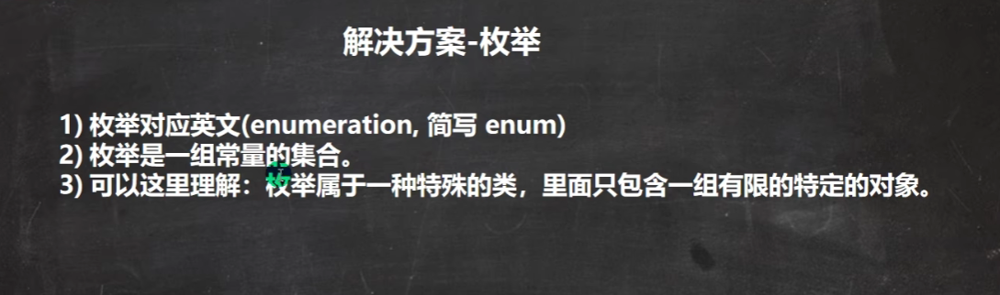

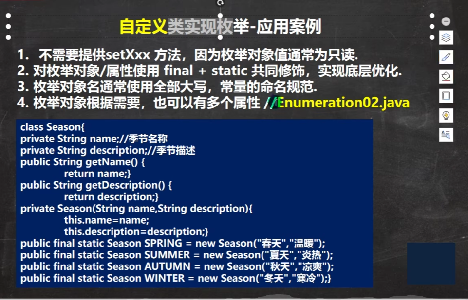

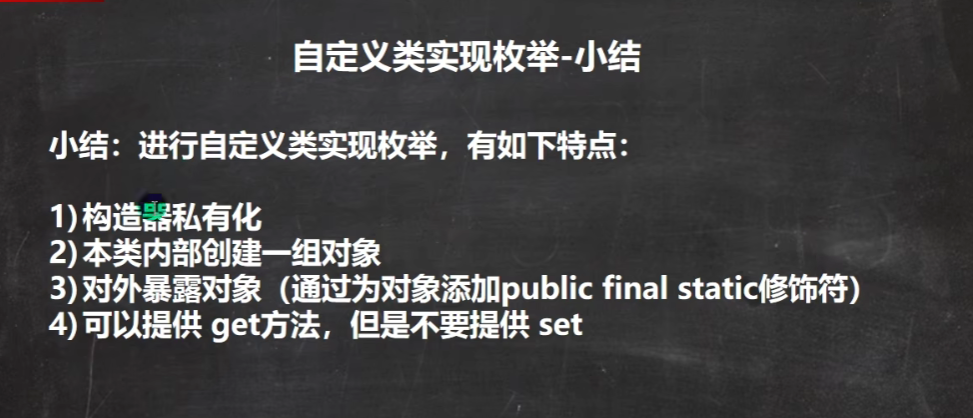

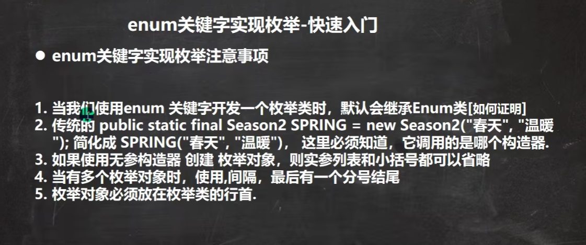

javap反编译的结果：

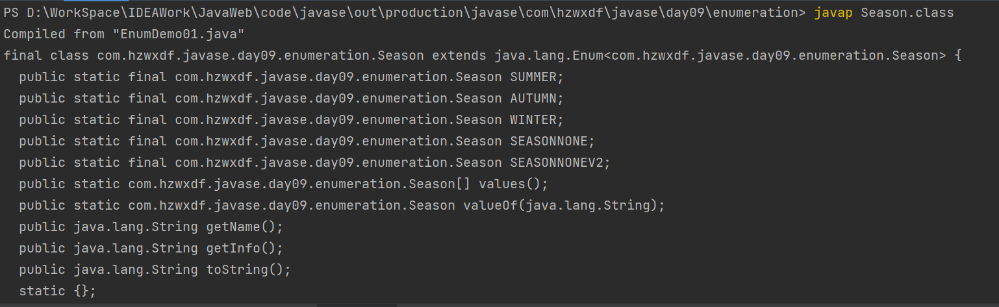

```java
/**
 * 枚举的使用
 */
public class EnumDemo01 {
    public static void main(String[] args) {
        // 自定义枚举演示
        System.out.println(CustomEnum.SPRING);
        System.out.println(CustomEnum.SUMMER);
        System.out.println(CustomEnum.AUTUMN);
        System.out.println(CustomEnum.WINTER);
        // 枚举演示
        System.out.println(Season.SPRING);
        System.out.println(Season.SUMMER);
        System.out.println(Season.AUTUMN);
        System.out.println(Season.WINTER);
        System.out.println(Season.SEASON_NONE);
    }
}

/**
 * 自定义枚举
 * 1.属性和构造器私有
 * 2.不提供set方法
 * 3.提供公共的static final的对象常量
 */
class CustomEnum {
    private String name;
    private String info;

    public static final CustomEnum SPRING = new CustomEnum("春季", "春天");
    public static final CustomEnum SUMMER = new CustomEnum("夏季", "夏天");
    public static final CustomEnum AUTUMN = new CustomEnum("秋季", "秋天");
    public static final CustomEnum WINTER = new CustomEnum("冬季", "冬天");

    private CustomEnum(String name, String info) {
        this.name = name;
        this.info = info;
    }

    public String getName() {
        return name;
    }

    public String getInfo() {
        return info;
    }

    @Override
    public String toString() {
        return "CustomEnum{" +
                "name='" + name + '\'' +
                ", info='" + info + '\'' +
                '}';
    }
}

/**
 * 枚举
 */
enum Season {
    // 对象创建必须放在行首
    SPRING("春季", "春天"),
    SUMMER("夏季", "夏天"),
    AUTUMN("秋季", "秋天"),
    WINTER("冬季", "冬天"),
    // 使用无参构造器时的对象创建
    SEASON_NONE(),
    SEASON_NONE_V2;


    private String name;

    private String info;

    // 无参构造器
    private Season() {
    }

    private Season(String name, String info) {
        this.name = name;
        this.info = info;
    }

    public String getName() {
        return name;
    }

    public String getInfo() {
        return info;
    }

    @Override
    public String toString() {
        return "Season{" +
                "name='" + name + '\'' +
                ", info='" + info + '\'' +
                '}';
    }

}
```

### 1.2 枚举的常用方法

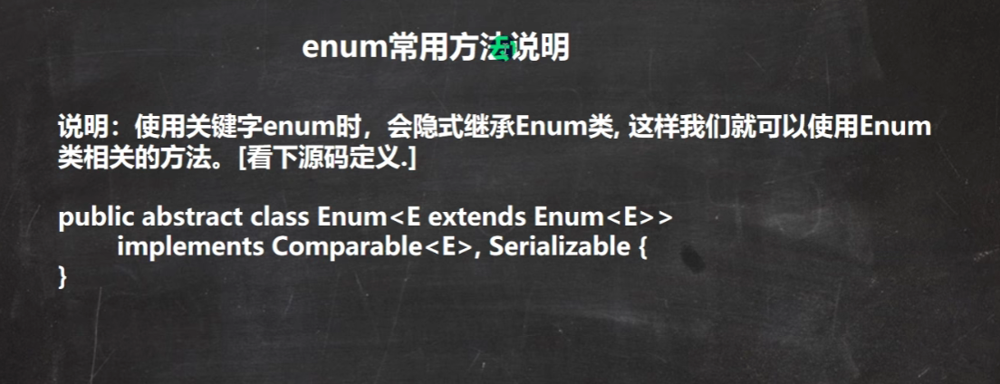

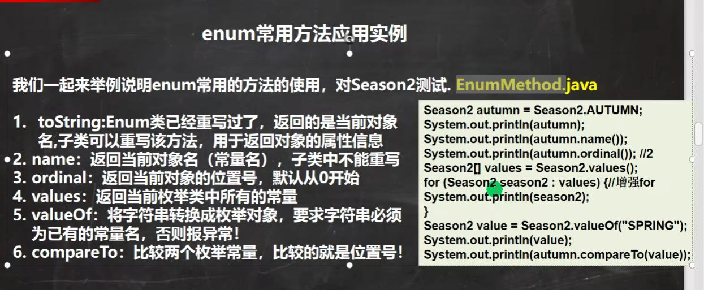

```java
/**
 * 枚举类的常用方法演示
 */
public class EnumDemo02 {
    public static void main(String[] args) {
        Season2 spring = Season2.SPRING;
        // toString(): Enum类重写过了，返回枚举的常量名
        System.out.println("toString(): " + spring);// => SPRING
        // name(): 返回当前枚举对象的常量名，子类中不能重写
        System.out.println("name(): " + spring.name());// => SPRING
        // ordinal(): 返回当前枚举对象的次序/编号，默认从0开始
        System.out.println("ordinal(): " + spring.ordinal());
        // values(): 返回枚举的全部枚举对象/常量
        Season2[] season2s = Season2.values();
        for (Season2 season2 : season2s) {
            System.out.println("values(): " + season2);
        }
        // valueof(): 将字符串常量转成枚举对象，字符串必须和已有的枚举对象名/常量名一致。
        // 执行流程：根据输入的字符串"SUMMER"去已经存在的枚举对象中去查找，找到就返回，找不到就报错。
        Season2 summer = Season2.valueOf("SUMMER");
        System.out.println("valueof(): " + summer);
        // compareTo(): 比较两个枚举常量，比较的就是ordinal 编号。比较过程就是WINTER的ordinal - AUTUMN的ordinal
        System.out.println("compareTo():" + Season2.WINTER.compareTo(Season2.AUTUMN));
        System.out.println("compareTo():" + Season2.WINTER.compareTo(Season2.SPRING));
    }
}

enum Season2 {
    // 对象创建必须放在行首
    SPRING("春季", "春天"),
    SUMMER("夏季", "夏天"),
    AUTUMN("秋季", "秋天"),
    WINTER("冬季", "冬天");

    private String name;
    private String info;

    private Season2(String name, String info) {
        this.name = name;
        this.info = info;
    }

    public String getName() {
        return name;
    }

    public String getInfo() {
        return info;
    }
}
```

### 1.3 枚举的细节

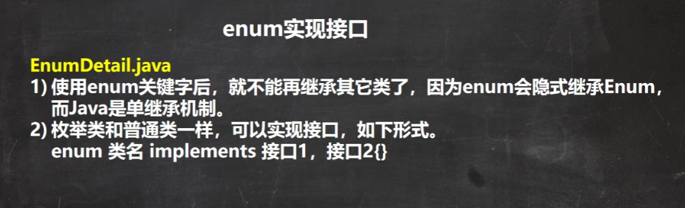

```java
interface Say {
    void say();
}
enum Season implements Say {
    SPRING;
    void say() {
      System.out.println("enum say...");
    }
}
```


## 2. 注解

### 2.1 注解基本介绍

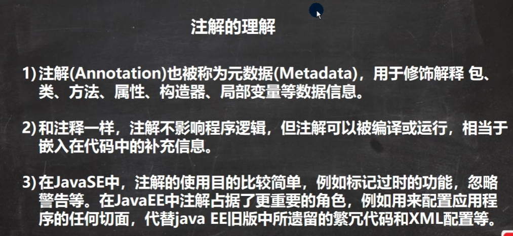

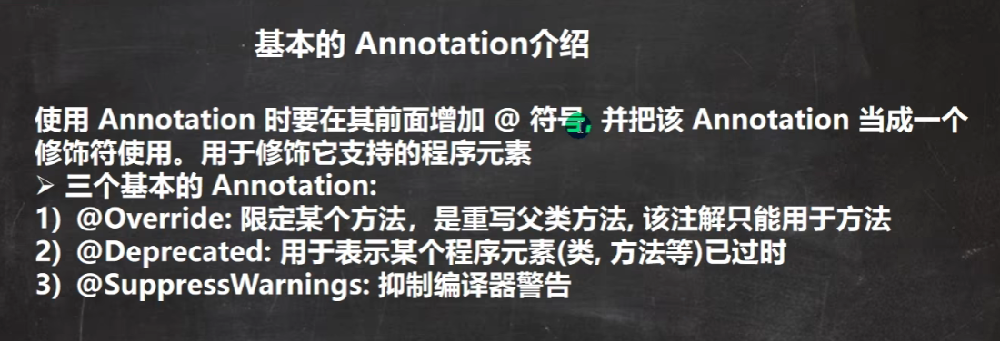

### 2.2 @Override注解

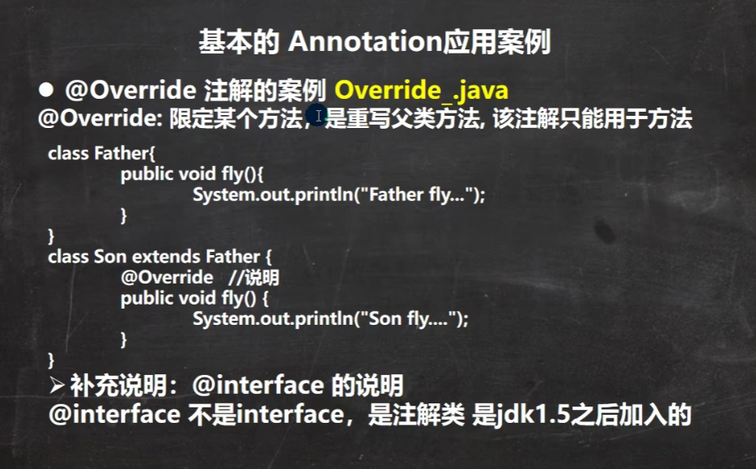

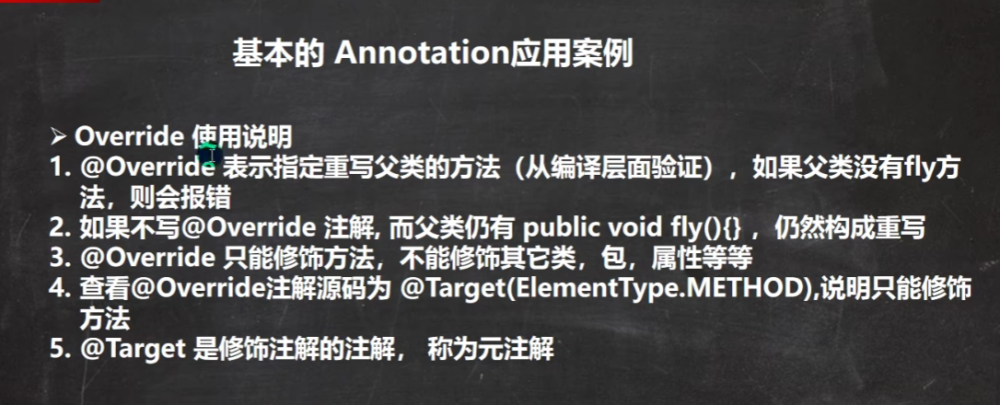

```java
/**
 * 基本注解 @Override 演示
 */
public class AnnotationDemo01Override {
    public static void main(String[] args) {

    }
}
class Father {
    public void say() {
        System.out.println("父类的say()....");
    }
}
class Son extends Father {

    /**
     * Override： 表示子类的该方法是重写父类的方法。只能用在方法上。
     * Override注解的作用：给方法加上该注解后，编译器会去检查你是否真的重写了父类方法。
     *   如果的确重写了，则编译通过。如果没重写，则编译不通过。
     */
    @Override
    public void say() {
        super.say();
        System.out.println("子类的say()...");
    }

//    // 编译不通过
//    @Override
//    public void speak() {
//
//    }
}
```

### 2.3 @Deprecated注解

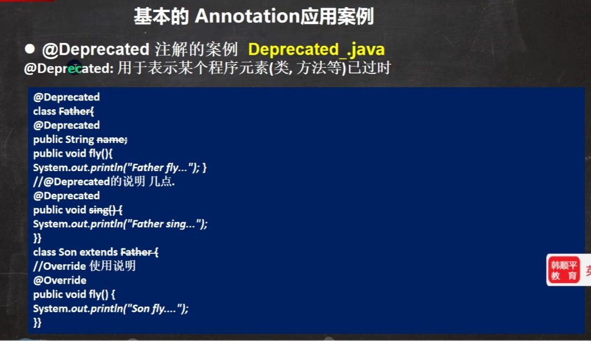

### 2.4 @SuppressWarnings注解

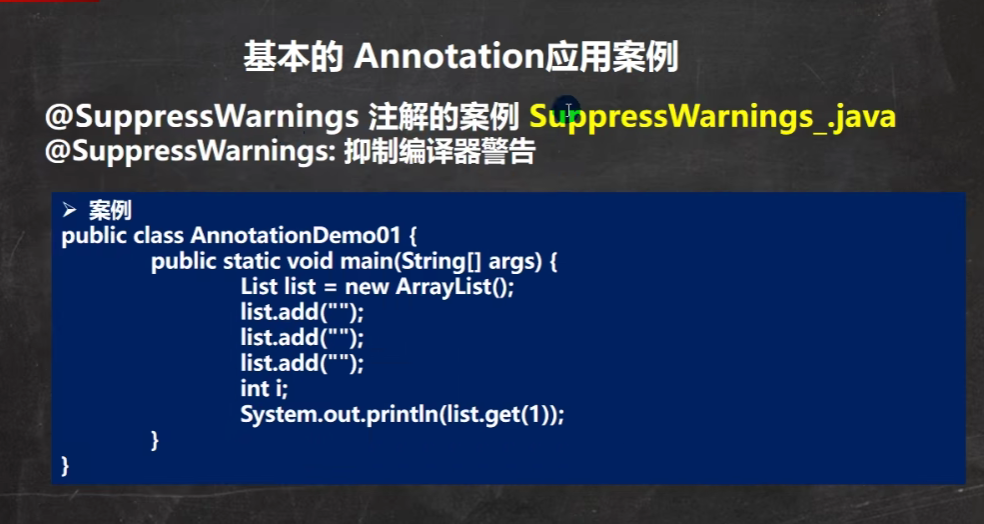

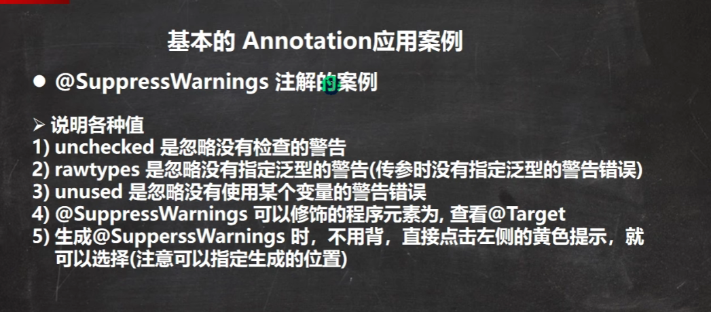

### 2.5 4种元注解

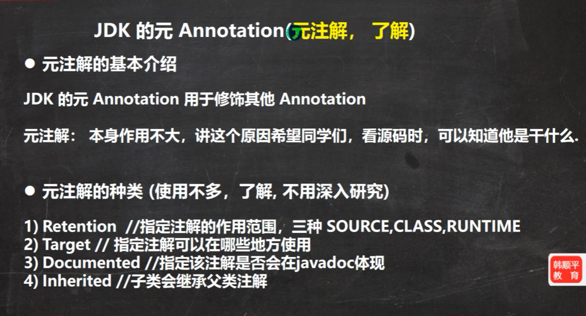

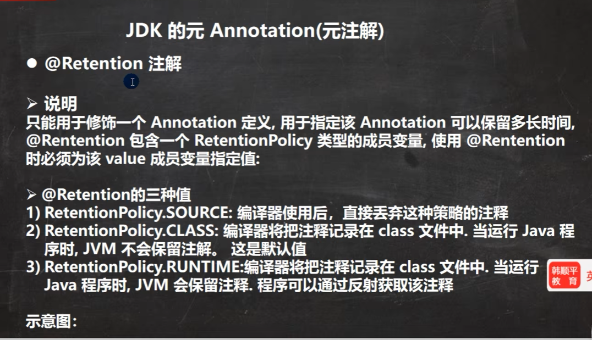

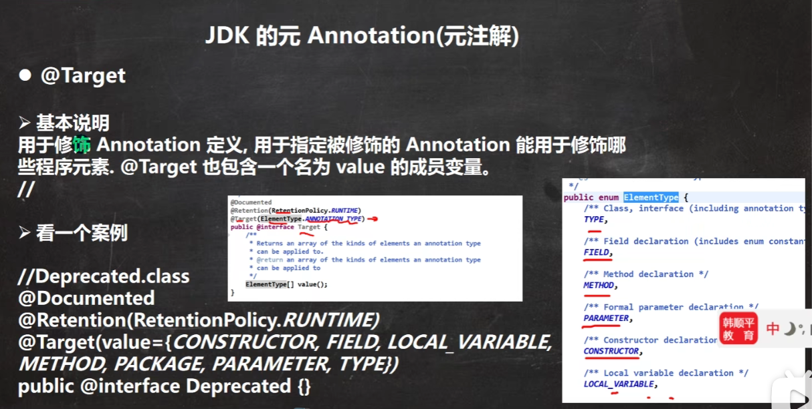

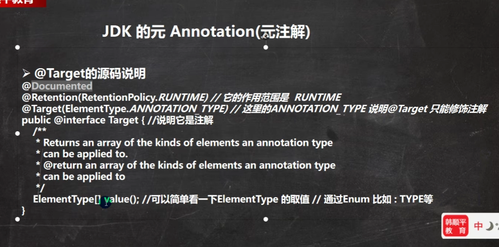

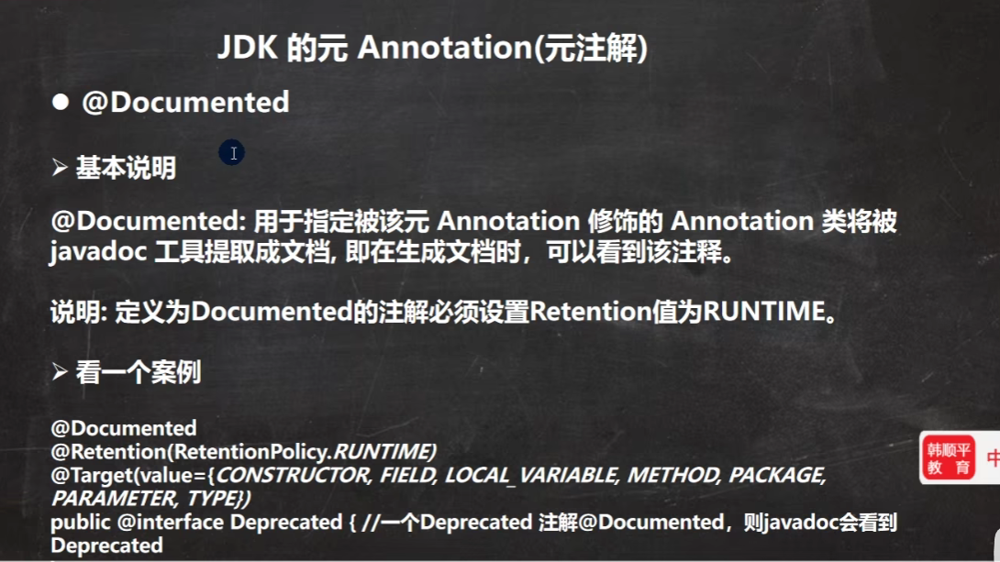

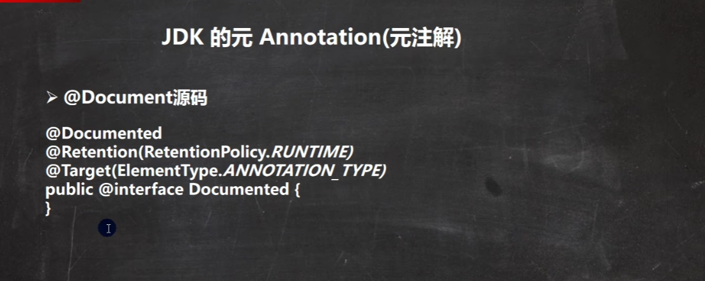

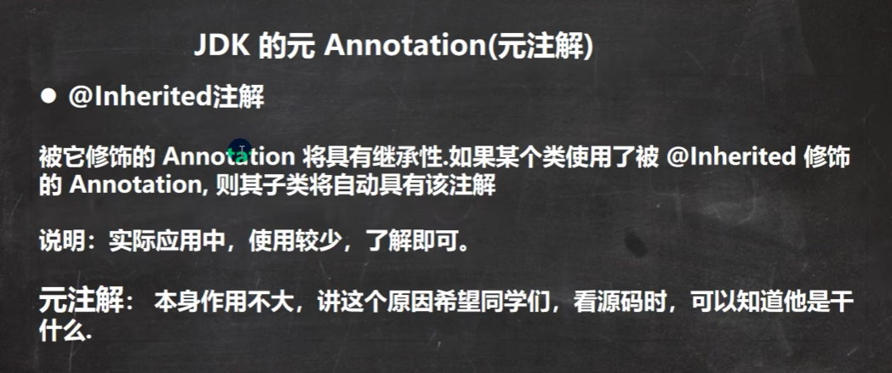

```java
import java.lang.annotation.*;

/**
 * 元注解：修饰注解的注解
 * 1. @Retention    指明该注解的作用范围
 * 2. @Target       指明该注解的作用位置
 * 3. @Documented   表明该注解会被输出刀javadoc 文档中
 * 4. @Inherited    表明该注解可以被子类自动继承
 */
public class AnnotationDemo04MetaAnnotation {
    public static void main(String[] args) {

        // 注解 @Retention 的演示
        @AD04Retention
        int age = 10;

        // 注解 @Target 的演示
        @AD04Target
        int sum = 10;
    }
}

/**
 * 注解 @Retention 的演示
 * 该注解可设置的范围
 * 1. RetentionPolicy.SOURCE     只存在source中，编译成class文件后就不存在了。
 * 2. RetentionPolicy.CLASS      存在source和class文件中，编译成class文件还在，但是jvm运行时就不存在了
 * 3. RententionPolicy.RUNTIME   存在source、class文件、运行时中。编译成class文件还在，但是jvm运行时也还存在了
 */
@Retention(RetentionPolicy.SOURCE)
//@Retention(RetentionPolicy.CLASS)
//@Retention(RetentionPolicy.RUNTIME)
@Target({ElementType.LOCAL_VARIABLE})
@interface AD04Retention {
}

/**
 * 注解 @Target 的演示
 *  该注解可设置的作用位置： ElementType的源码
 *
 */
@Retention(RetentionPolicy.SOURCE)
@Target({ElementType.TYPE,ElementType.METHOD,ElementType.CONSTRUCTOR,ElementType.LOCAL_VARIABLE,ElementType.PARAMETER})
@interface AD04Target {
}

/**
 * 注解 @Documented 的演示
 *  该注解可以在生成Java doc文档时，该注解也一起生成。
 */
@Documented
@Retention(RetentionPolicy.SOURCE)
@Target(ElementType.LOCAL_VARIABLE)
@interface AD04Documented {
}

/**
 * 注解 @Inherited 的演示
 *  该注解可以在让子类自动继续父类的该注解
 */
@Documented
@Inherited
@Retention(RetentionPolicy.SOURCE)
@Target(ElementType.FIELD)
@interface AD04Inherited {
}

// 注解 @Inherited 的演示
class AD04InheritedFather {
    @AD04Inherited
    int age = 18;
}
class AD04InheritedSon extends AD04InheritedFather {
    // 子类自动拥有父类的@AD04Inherited 注解。
}
```


