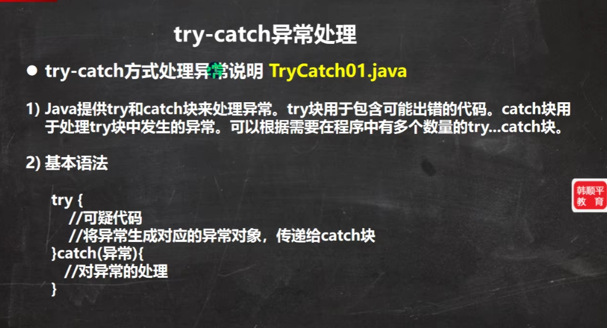

# Javase笔记 day10 异常

## 1. 异常的基本介绍


## 2. 异常体系


## 3. 常见的运行时异常


## 4. 异常处理机制

### 4.1 基本介绍


### 4.2 try-catch异常处理




```java
/**
 * 异常处理机制 try-catch
 * 只能二选一
 * 1.try-catch-finally
 * 2.throws
 */
public class ExceptionDemo02TryCatch {
    public static void main(String[] args) {
        tryCatchDemo();
        tryCatchFinallyDemo();
        tryFinallyDemo();
        System.out.println("程序继续执行");
    }

    /**
     * try-catch 演示
     * try { ... } catch { ... }
     *
     */
    public static void tryCatchDemo() {
        try {
            int a = 10;
            int b =0;
            int c = a / b;// ArithmeticException
        } catch (ArithmeticException arithmeticException) {
            System.out.println("算术异常=" + arithmeticException.getMessage());
        } catch (Exception exception) {
            System.out.println("其他异常=" + exception.getMessage());
        }
        System.out.println("tryCatchDemo()方法继续执行");
    }

    /**
     * try-catch-finally 演示
     * try { ... } catch(...) { ... } finally { ... }
     *
     */
    public static void tryCatchFinallyDemo() {
        try {
            int a = 10;
            int b =0;
            int c = a / b;// ArithmeticException
        } catch (ArithmeticException arithmeticException) {
            System.out.println("算术异常=" + arithmeticException.getMessage());
        } catch (Exception exception) {
            System.out.println("其他异常=" + exception.getMessage());
        } finally {
            // 不管是否发生异常，finally都会执行
            System.out.println("finally 代码块执行。。。");
        }
        System.out.println("tryCatchFinallyDemo()方法继续执行");
    }

    /**
     * try-finally 演示(相当于不处理异常)
     * try { ... } finally { ... }
     *
     */
    public static void tryFinallyDemo() {
        try {
            int a = 10;
            int b =0;
            int c = a / b;// ArithmeticException
        } finally {
            // 不管是否发生异常，finally都会执行
            System.out.println("finally 代码块执行。。。");
        }
        System.out.println("tryFinallyDemo()方法继续执行");
    }
}


```

### 4.3 throws异常处理


```java
/**
 * 异常处理机制 throws
 * 只能二选一
 * 1.try-catch-finally
 * 2.throws
 */
public class ExceptionDemo03Throws {
    public static void main(String[] args) {
        throwsDemo();
        System.out.println("程序继续执行");
    }

    /**
     *
     * throws 演示
     * (不手动throws时，默认就采取这种异常处理方式)
     */
    public static void throwsDemo() throws ArithmeticException, NullPointerException {
        int a = 10;
        int b =0;
        int c = a / b;// ArithmeticException
        System.out.println("throwsDemo()方法继续执行");
    }
}

/**
 * 子类只能抛出与父类一样的异常或者父类异常的子类异常
 */
class ExceptionDemo03Father {
    public void say() throws RuntimeException {
        System.out.println("父类抛出异常 RuntimeException");
    }
    public void eat() throws NullPointerException {
        System.out.println("父类抛出异常 NullPointerException");
    }
}
class ExceptionDemo03Son extends ExceptionDemo03Father {
    @Override
    public void say() throws NullPointerException {
        System.out.println("子类抛出 父类异常RuntimeException的子类异常NullPointerException");
    }
    @Override
    public void eat() throws NullPointerException {
        System.out.println("子类抛出 父类异常NullPointerException的相同异常NullPointerException");
    }
}
```

### 4.4 自定义异常


```java
/**
 * 自定义异常
 * 实现方式：
 *   1.继承 RuntimeException， 此类异常属于运行时异常
 *   2.继承 Exception，此类异常属于编译异常。
 * 比较：
 *   运行时异常不用手动处理，但是编译异常必须处理。所以一般自定义异常是继承RuntimeException
 */
public class ExceptionDemo04CustomException {
    public static void main(String[] args) throws EnameException {
        // 自定义运行时异常
        int age = 120;
        if (age < 0 || age > 120) {
            // throw  也是抛出异常，但是和throws不同的是，throw是在方法体内抛出异常对象
            // throws 是在方法声明处抛出异常类型
            throw new REAgeException("年龄只能在0-120之间");
        }
        System.out.println("年龄正确");

        // 自定义编译异常
        String name = "1abd";
        if (name.length() < 1 || name.length() > 8) {
            throw new EnameException("姓名只能是1-8个字符");
        }
        System.out.println("姓名正确");
    }
}

/**
 * 自定义运行时异常
 * 继承RuntimeException
 */
class REAgeException extends RuntimeException {
    public REAgeException(String message) {
        super(message);
    }
}
/**
 * 自定义编译异常
 *  继承Exception
 */
class EnameException extends Exception {
    public EnameException(String message) {
        super(message);
    }
}
```

### 4.5 throw和throws


