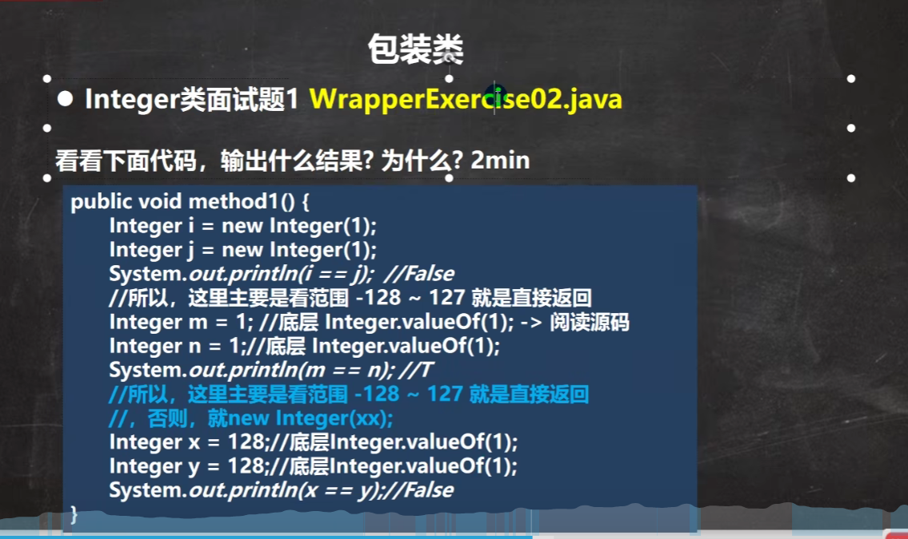
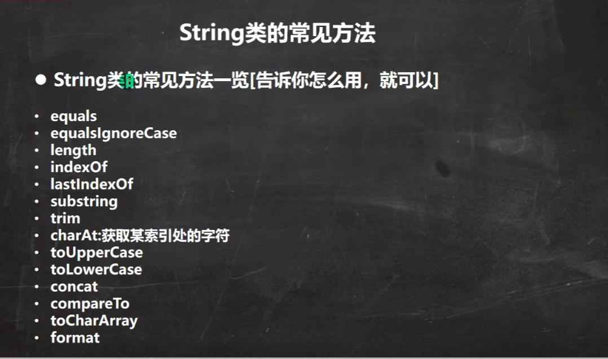
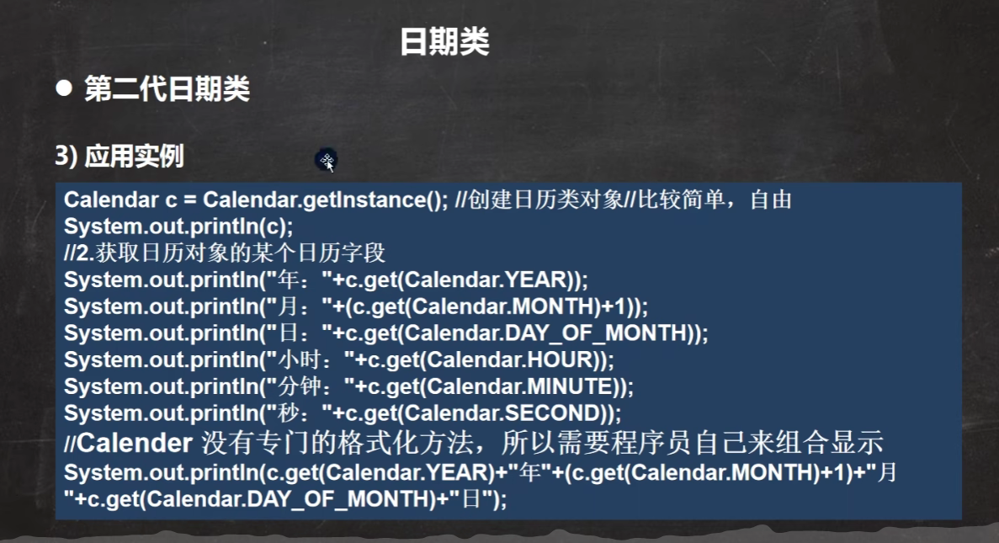
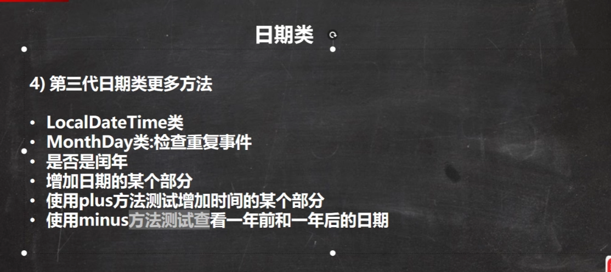

# Javase笔记 day11 常用类的使用

# 1. 8大Wrapper类





```java
/**
 * Java 八大基本数据类型的包装类
 *  boolean  Boolean    父类是Object
 *  char     Character  父类是Object
 *  byte     Byte       父类是Number
 *  short    Short      父类是Number
 *  int      Integer    父类是Number
 *  long     Long       父类是Number
 *  float    Float      父类是Number
 *  double   Double     父类是Number
 */
public class BasicDataTypeWrapperDemo01 {
    public static void main(String[] args) {

        /**
         * 基本数据类型的自动装箱和自动拆箱
         * 装箱： 基本数据类型 -> 基本数据类型的包装类
         * 拆箱:  基本数据类型的包装类 -> 基本数据类型
         */
        Boolean b1 = true;
        boolean b2 = b1;
        Character c1 = 'a';
        char c2 = c1;
        Byte by1 = 1;
        byte by2 = by1;
        Short s1 = 10;
        short s2 = s1;
        Integer i1 = 20;
        int i2 = i1;
        Long l1 = 20L;
        long l2 = l1;
        Float f1 = 2.5F;
        float f2 = f1;
        Double d1 = 1.6D;
        double d2 = d1;

        /**
         * 自动装箱和自动拆箱的细节(以Integer为例)
         *   自动装箱时会使用Integer.valueOf()方法，这个方法在值是 -128~127之间时，直接从缓存数组中取
         *     public static Integer valueOf(int i) {
         *         if (i >= Integer.IntegerCache.low && i <= Integer.IntegerCache.high)
         *             return Integer.IntegerCache.cache[i + (-Integer.IntegerCache.low)];
         *         return new Integer(i);
         *     }
         *   自动拆箱时会调用 Integer.intValue()
         */
        Integer integer1 = 20;// 这里会调用 Integer.valueOf()方法
        int integer2 = integer1;// 这里会调用 Integer.intValue()方法

        // Integer.valueOf()方法的缓存数组确认
        Integer v01 = -128;
        int v02 = -128;
        System.out.println(v01 == v02);// 两个对象在比较，== 是比较地址，这2个都是从缓存数组取的同一个对象，所以为true

        Integer v1 = 127;
        Integer v2 = 127;
        System.out.println(v1 == v2);// 两个对象在比较，== 是比较地址，这2个都是从缓存数组取的同一个对象，所以为true

        Integer v3 = 127;
        int v4 = 127;
        System.out.println(v3 == v4);// 有基本数据类型时，== 是比较值，这2个值相等，所以为true

        Integer v5 = new Integer(127);
        Integer v6 = new Integer(127);
        System.out.println(v5 == v6);// 两个对象在比较，== 是比较地址，2个都是new的对象，所以false

        Integer v7 = -128;
        Integer v8 = new Integer(-128);
        System.out.println(v7 == v8);// 两个对象在比较，== 是比较地址，1个是缓存数组取的对象，一个是new的对象，所以false

    }
}
```

## 2. String类

### 2.1 基本介绍


### 2.2 测试题


### 2.3 String对象特性


### 2.4 String的常用方法





```java
import java.util.Arrays;

/**
 * String类的常用方法
 *
 */
public class StringDemo01Method {
    public static void main(String[] args) {
        String s1 = "hello java";
        // equals: 判断内容是否相等
        System.out.println("equals \t" + "hello java".equals(s1));
        System.out.println("equals \t" + "first app".equals(s1));
        // equalsIgnoreCase: 忽略大小写判断内容是否相等
        System.out.println("equalsIgnoreCase \t" + "Hello Java".equalsIgnoreCase(s1));
        // startsWith: 判断字符串是否以指定字符串开头
        System.out.println("startsWith \t" + s1.startsWith("hello"));
        // endsWith: 判断字符串是否以指定字符串结尾
        System.out.println("endsWith \t" + s1.endsWith("java"));
        // length: 获取字符串的长度
        System.out.println("length \t" + s1.length());
        // indexOf: 获取指定字符的第一下标，0开始
        System.out.println("indexOf \t" + s1.indexOf("a"));
        // lastIndexOf: 获取指定字符的最后一个下标，0开始
        System.out.println("lastIndexOf \t" + s1.lastIndexOf("a"));
        // substring: 获取指定下标的字符串子串。
        System.out.println("substring \t" + s1.substring(6));// 获取下标6开始的字符串
        System.out.println("substring \t" + s1.substring(6,8));// 获取下标[6,8)的字符串

        String s2 = " hello java ";
        // trim: 去掉字符串首尾的空格
        System.out.println("trim \t" + s2.trim());// hello java
        // charAt: 获取指定下标的字符
        System.out.println("charAt \t" + s2.charAt(7));
        // toLowerCase: 获取字符串的全小写
        System.out.println("toLowerCase \t" + "HELLO WORLD".toLowerCase());
        // toUpperCase: 获取字符串的全大写
        System.out.println("toUpperCase \t" + "hello world".toUpperCase());
        // concat: 连接两个字符串
        System.out.println("concat \t" + s2.concat(" se"));
        // replace: 替换指定字符串
        System.out.println("replace \t" + s2.replace("java", "java se"));
        // split: 按照指定规则切割字符串
        System.out.println("split \t" + Arrays.toString(s2.split("")));// 每个字符切割
        System.out.println("split \t" + Arrays.toString(s2.split(" ")));// 按照空格切割
        // toCharArray: 将字符串转成字符数组
        System.out.println("toCharArray \t" + Arrays.toString(s2.toCharArray()));

        // compareTo: 比较两个字符串，相同返回0，前者大返回正数，后者大返回负数。
        // 相同数量的字符，是比较字符相减，不同数量的字符，是字符长度相减。
        String s3 = "java s1";
        System.out.println("compareTo \t" + s3.compareTo("java s1"));
        System.out.println("compareTo \t" + s3.compareTo("java s0"));
        System.out.println("compareTo \t" + s3.compareTo("java s123"));

        /**
         * format
         * %s    字符串
         * %d    整型
         * %c    字符
         * %.2f  小数点保留2位的浮点型
         */
        String formatStr = "format演示：字符串(%s)、整型(%d)、字符(%c)、浮点型(%.2f)";
        System.out.println("format \t" + String.format(formatStr, "hello", 100, 'A', 65.123F));
        System.out.println("format \t" + String.format(formatStr, "world", 200L, 'B', 75.123D));
    }
}
```

### 2.5 StringBuffer类


```java
/**
 * StringBuffer类
 * 1.StringBuffer类是final类，不可被继承
 * 2.StringBuffer类的 char[] 不是final的，可以被修改。
 * 3.StringBuffer类的默认空间是16字符。
 * 4.StringBuffer类是线程安全的。
 */
public class StringDemo03StringBuffer {
    public static void main(String[] args) {
        // 使用无参构造器创建对象，char[] 大小是 16
        StringBuffer sb1 = new StringBuffer();
        // 使用指定大小的构造器创建对象， char[] 大小是 指定值
        StringBuffer sb2 = new StringBuffer(20);
        // 使用指定字符串的构造器创建对象， char[] 大小是 指定字符串的长度+16
        StringBuffer sb3 = new StringBuffer("hello");

        StringBuffer sb = new StringBuffer();
        // append: 在既存的字符串后面添加
        sb.append("hello").append(true).append(100);
        System.out.println(sb.toString());
        // delete: 删除指定下标[start, end)的字符串
        sb.delete(0, 1);
        System.out.println(sb.toString());
        // insert: 在指定位置插入字符串
        sb.insert(0, "h");
        System.out.println(sb.toString());
        // indexOf: 查找指定字符串下标
        System.out.println(sb.indexOf("100"));
        // length: 获取字符长度
        System.out.println(sb.length());


    }
}
```


### 2.6 StringBuilder类


```java
/**
 * StringBuilder类
 * 1.StringBuilder类的功能和StringBuffer类 差不多。
 * 2.StringBuilder类是线程不安全的，适合单线程使用。
 */
public class StringDemo04StringBuilder {
    public static void main(String[] args) {
        StringBuilder sb = new StringBuilder();
        sb.append("hello").append("test");
        System.out.println(sb.toString());
    }
}
```

## 3. Math类


```java
/**
 * Math类
 *  常用方法
 */
public class MathDemo01 {
    public static void main(String[] args) {
        // abs: 求绝对值
        System.out.println("abs \t" + Math.abs(-12));
        System.out.println("abs \t" + Math.abs(-8.6));
        // pow: 求幂
        System.out.println("pow \t" + Math.pow(3.0, 2.0));// 3 的 2次幂
        System.out.println("pow \t" + Math.pow(3.0, 3.0));// 3 的 3次幂
        // sqrt: 开根号
        System.out.println("sqrt \t" + Math.sqrt(4.0));// 根号4 = 2
        System.out.println("sqrt \t" + Math.sqrt(9.0));// 根号9 = 3

        // ceil: 向上取整，返回整数(转成double)
        System.out.println("ceil \t" + Math.ceil(2.4));
        System.out.println("ceil \t" + Math.ceil(2.5));
        System.out.println("ceil \t" + Math.ceil(2.6));
        // floor: 向下取整，返回整数(转成double)
        System.out.println("floor \t" + Math.floor(2.4));
        System.out.println("floor \t" + Math.floor(2.5));
        System.out.println("floor \t" + Math.floor(2.6));
        // round: 四舍五入，返回整数Long
        System.out.println("round \t" + Math.round(2.4));
        System.out.println("round \t" + Math.round(2.5));
        System.out.println("round \t" + Math.round(2.6));
        // random: 获取一个 [0.0, 1.0) 之间的随机数double
        System.out.println("random \t" + Math.random());
        System.out.println("random \t" + Math.random());
        System.out.println("random \t" + (Math.random() * 10));// [0-10)之间的随机数
        System.out.println("random \t" + (Math.random() * 5));// [0-5)之间的随机数
        // max: 两个数之间的最大值
        System.out.println("max \t" + Math.max(1, 2));
        System.out.println("max \t" + Math.max(4.1, 5.2));
        // min: 两个数之间的最大值
        System.out.println("min \t" + Math.min(1, 2));
        System.out.println("min \t" + Math.min(4.1, 5.2));

    }
}
```

## 4. Arrays类


```java
import java.util.Arrays;
import java.util.Comparator;
import java.util.List;

/**
 * Arrays 类
 *
 */
public class ArraysDemo01Method {
    public static void main(String[] args) {
        // toString: 数组输出
        Integer[] arr = {1, 0, -2, 66, 4};
        System.out.println("toString \t" + Arrays.toString(arr));

        // sort: 使用默认排序(自然排序)
        System.out.println("sort 默认排序前 \t" + Arrays.toString(arr));
        Arrays.sort(arr);
        System.out.println("sort 默认排序后 \t" + Arrays.toString(arr));
        // sort: 传入Comparator接口实现类，实现compare方法。以此来达到自定义排序。
        // 底层会调用 compare 方法进行比较
        Arrays.sort(arr, new Comparator<Integer>() {
            @Override
            public int compare(Integer o1, Integer o2) {
                return o2 - o1;
            }
        });
        System.out.println("sort 自定义排序后 \t" + Arrays.toString(arr));

        // binarySearch: 二叉查找
        Integer[] sortArr = {1, 4, 5, 6, 9};
        // 使用二叉查找3的下标,不存在返回负数: - (应该在的下标 + 1)
        // 这里3应该是在1-4(下标0-1)之间，所以应该在的下标是1，所以结果是 -(1+1) = -2
        int idx1 = Arrays.binarySearch(sortArr, 3);
        System.out.println("binarySearch: \t" + idx1);
        // 使用二叉查找4的下标,存在返回对应下标
        int idx2 = Arrays.binarySearch(sortArr, 6);
        System.out.println("binarySearch: \t" + idx2);

        // copyof: 数组复制(底层使用的是System.arraycopy)
        int[] oldArr = {1, 4, 5, 6, 9};
        int[] copy = Arrays.copyOf(oldArr, oldArr.length);
        System.out.println("copyOf:前 \t" + Arrays.toString(oldArr));
        System.out.println("copyOf:后 \t" + Arrays.toString(copy));

        // fill: 数组填充，使用指定数填充数据全部元素
        int[] fillArr = new int[]{1, 2, 3};
        System.out.println("fill:前 \t" + Arrays.toString(fillArr));
        Arrays.fill(fillArr, 99);
        System.out.println("fill:后 \t" + Arrays.toString(fillArr));

        // equals: 比较两个数组内容是否相等。
        System.out.println("equals: \t" + Arrays.equals(new int[]{1, 2, 3}, new int[]{1, 2, 3}));
        System.out.println("equals: \t" + Arrays.equals(new int[]{1, 2, 3}, new int[]{3, 2, 1}));
        System.out.println("equals: \t" + Arrays.equals(new int[]{1, 2, 3}, new int[]{3, 2, 1, 4}));

        // asList: 将数组转成List
        int[] listArr = {1, 2, 3, 4, 5};
        List list = Arrays.asList(listArr);
    }
}


```

## 5. System类


```java
import java.util.Arrays;

/**
 * System类常用方法
 */
public class SystemDemo01Method {
    public static void main(String[] args) {

        Boolean flag = false;
        if (flag) {
            // 退出程序
            System.exit(0);
        }
        System.out.println("exit 继续执行");

        System.out.println("1970-1-1到现在的毫秒：" + System.currentTimeMillis());

        int[] old = {1, 2, 3, 4};
        int[] dest1 = new int[10];
        int[] dest2 = new int[10];
        // 将old数组中下标0开始的元素 赋值 到dest1数组中，从 0 下标开始，赋值 old.length 个元素。
        System.arraycopy(old, 0, dest1, 0 , old.length);
        // 将old数组中下标1开始的元素 赋值 到dest2数组中，从 3 下标开始，赋值 2 个元素。
        System.arraycopy(old, 1, dest2, 3, 2);
        System.out.println("arraycopy: \t" + Arrays.toString(dest1));// [1, 2, 3, 4, 0, 0, 0, 0, 0, 0]
        System.out.println("arraycopy: \t" + Arrays.toString(dest2));// [0, 0, 0, 2, 3, 0, 0, 0, 0, 0]

        // 调用垃圾回收器
        System.gc();
    }
}


```

## 6. BigInteger类和BigDecimal类


```java
import java.math.BigDecimal;
import java.math.BigInteger;

/**
 * BigInteger类和BigDecimal类
 *
 */
public class BigDataDemo01 {
    public static void main(String[] args) {
        /**
         * BigInteger类 大整数
         */
        System.out.println("BigInteger类-------------------");
        // Long l = 231455999999999999999L;

        BigInteger bigInt1 = new BigInteger("231455999999999999999");
        BigInteger bigInt2 = new BigInteger("4999999999999");
        // 加减乘除必须调用对应方法，不能直接 + - * /
        System.out.println("加法(add): \t" + bigInt1.add(bigInt2));
        System.out.println("加法(subtract): \t" + bigInt1.subtract(bigInt2));
        System.out.println("乘法(multiply): \t" + bigInt1.multiply(bigInt2));
        System.out.println("除法(divide): \t" + bigInt1.divide(bigInt2));

        /**
         * BigDecimal类 大小数
         */
        System.out.println("BigDecimal类-------------------");
        double b = 12323999.564799999999999999999999999999999999999222222222222d;
        System.out.println("double=" + b);// double=1.23239995648E7

        BigDecimal bigDecimal1 = new BigDecimal("12323999.564799999999999999999999999999999999999222222222222");
        BigDecimal bigDecimal2 = new BigDecimal("999.56479999999999999999999999999999999933333333");
        System.out.println("BigDecimal=" + bigDecimal1);
        // 加减乘除必须调用对应方法，不能直接 + - * /
        System.out.println("加法(add): \t" + bigDecimal1.add(bigDecimal2));
        System.out.println("加法(subtract): \t" + bigDecimal1.subtract(bigDecimal2));
        System.out.println("乘法(multiply): \t" + bigDecimal1.multiply(bigDecimal2));
        /**
         * 除法除不尽的话，可能抛出异常ArithmeticException
         * 解决办法时，在除法时指定一个精度
         * BigDecimal.ROUND_CEILING: 表示无限循环小数，会保留分子的精度
         */
        // System.out.println("除法(divide): \t" + bigDecimal1.divide(bigDecimal2));
        System.out.println("除法(divide): \t" + bigDecimal1.divide(bigDecimal2, BigDecimal.ROUND_CEILING));
    }
}


```

## 7. 日期相关类

### 7.1 Date类(第一代日期)


```java
import java.text.ParseException;
import java.text.SimpleDateFormat;
import java.util.Date;

/**
 * Date类
 *   第一代日期类
 */
public class DateDemo01Date {
    public static void main(String[] args) {
        Date date = new Date();
        System.out.println("当前系统时间:" + date);
        Date date1 = new Date(1299999);
        System.out.println("构造器指定毫秒的日期:" + date1);
        Date date3 = new Date("2000/1/1");
        System.out.println("构造器指定日期字符串:" + date3);

        // 格式化日期输出
        SimpleDateFormat simpleDateFormat = new SimpleDateFormat("yyyy:MM:dd hh:mm:ss E");
        String format = simpleDateFormat.format(date);
        System.out.println("当前系统时间:(格式化) \t" + format);
        String format2 = simpleDateFormat.format(date1);
        System.out.println("构造器指定毫秒的日期:(格式化) \t" + format2);
        // 将格式化字符串转成Date，格式不符合会导致转换异常
        Date date2 = null;
        try {
            date2 = simpleDateFormat.parse(format2);
        } catch (ParseException e) {
            throw new RuntimeException(e);
        }
        System.out.println(date2);


    }
}


```

### 7.2 Calendar类(日历)




```java
import java.util.Calendar;

/**
 * Calender类
 *   第二代日期
 */
public class DateDemo02Calendar {
    public static void main(String[] args) {
        Calendar calendar = Calendar.getInstance();
        System.out.println("日历：" + calendar);
        // Calendar 有很多年月日等相关字段
        System.out.println("年: \t" + calendar.get(Calendar.YEAR));
        System.out.println("月: \t" + (calendar.get(Calendar.MONTH) + 1));// Calendar.MONTH是从0-11，所以需要加1
        System.out.println("日: \t" + calendar.get(Calendar.DAY_OF_MONTH));
        System.out.println("小时: \t" + calendar.get(Calendar.HOUR));
        System.out.println("分钟: \t" + calendar.get(Calendar.MINUTE));
        System.out.println("秒: \t" + calendar.get(Calendar.SECOND));

        // Calendar 没有格式化方法，需要自己组合。
        System.out.println("自定义格式: " + calendar.get(Calendar.YEAR) + "/" + (calendar.get(Calendar.MONTH) + 1) + "/" + calendar.get(Calendar.DAY_OF_MONTH));


    }
}


```

### 7.3 LocalDate类 第三代日期




```java
import java.time.*;
import java.time.format.DateTimeFormatter;
import java.time.temporal.TemporalAccessor;

/**
 * LocalDate、LocalTime、LocalDateTime类
 *   第三代日期
 */
public class DateDemo03LocalDate {
    public static void main(String[] args) {
        // 日期，只能操作日期
        LocalDate localDate = LocalDate.now();
        System.out.println(localDate);
        // 时间，只能操作时间
        LocalTime localTime = LocalTime.now();
        System.out.println(localTime);
        // 日期时间，日期和时间都能操作
        LocalDateTime localDateTime = LocalDateTime.now();
        System.out.println(localDateTime);

        System.out.println("年、月、日、小时、分钟、秒-------------");
        System.out.println("年: \t" + localDateTime.getYear());
        System.out.println("月:(英文) \t" + localDateTime.getMonth());
        System.out.println("月:(数字) \t" + localDateTime.getMonthValue());
        System.out.println("日: \t" + localDateTime.getDayOfMonth());
        System.out.println("小时: \t" + localDateTime.getHour());
        System.out.println("分钟: \t" + localDateTime.getMinute());
        System.out.println("秒: \t" + localDateTime.getSecond());

        System.out.println("LocalDateTime 格式化-------------");
        DateTimeFormatter dateTimeFormatter = DateTimeFormatter.ofPattern("yyyy:MM:dd HH:mm:ss E");
        String format = dateTimeFormatter.format(localDateTime);
        System.out.println("格式化LocalDateTime: \t" + format);

        System.out.println("Instant 时间戳-------------");
        // 时间戳
        Instant instant = Instant.now();
        System.out.println(instant);
        // 时间戳与日期的相互转换
        LocalDateTime localDateTime1 = LocalDateTime.ofInstant(instant, ZoneOffset.UTC);
        System.out.println("时间戳->日期时间: \t" + localDateTime1);
        Instant instant1 = localDateTime1.toInstant(ZoneOffset.UTC);
        System.out.println("日期时间->时间戳: \t" + instant1);

        System.out.println("日期时间操作------------------");
        DateTimeFormatter dateTimeFormatter1 = DateTimeFormatter.ofPattern("yyyy:MM:dd HH:mm:ss");
        TemporalAccessor parse = dateTimeFormatter1.parse("2023:01:01 00:00:00");
        LocalDateTime localDateTime2 = LocalDateTime.from(parse);
        System.out.println(dateTimeFormatter1.format(localDateTime2));
        // 对时间进行加
        System.out.println("日期时间操作(加 plus)---------------");
        System.out.println("年份：\t" + dateTimeFormatter1.format(localDateTime2.plusYears(1)));
        System.out.println("月份：\t" + dateTimeFormatter1.format(localDateTime2.plusMonths(1)));
        System.out.println("日： \t" + dateTimeFormatter1.format(localDateTime2.plusDays(1)));
        System.out.println("小时：\t" + dateTimeFormatter1.format(localDateTime2.plusHours(1)));
        System.out.println("分钟：\t" + dateTimeFormatter1.format(localDateTime2.plusMinutes(1)));
        System.out.println("秒： \t" + dateTimeFormatter1.format(localDateTime2.plusSeconds(1)));
        // 对时间进行减
        System.out.println("日期时间操作(减 minus)---------------");
        System.out.println("年份：\t" + dateTimeFormatter1.format(localDateTime2.minusYears(1)));
        System.out.println("月份：\t" + dateTimeFormatter1.format(localDateTime2.minusMonths(1)));
        System.out.println("日： \t" + dateTimeFormatter1.format(localDateTime2.minusDays(1)));
        System.out.println("小时：\t" + dateTimeFormatter1.format(localDateTime2.minusHours(1)));
        System.out.println("分钟：\t" + dateTimeFormatter1.format(localDateTime2.minusMinutes(1)));
        System.out.println("秒： \t" + dateTimeFormatter1.format(localDateTime2.minusSeconds(1)));

    }
}


```

## 8. 练习


