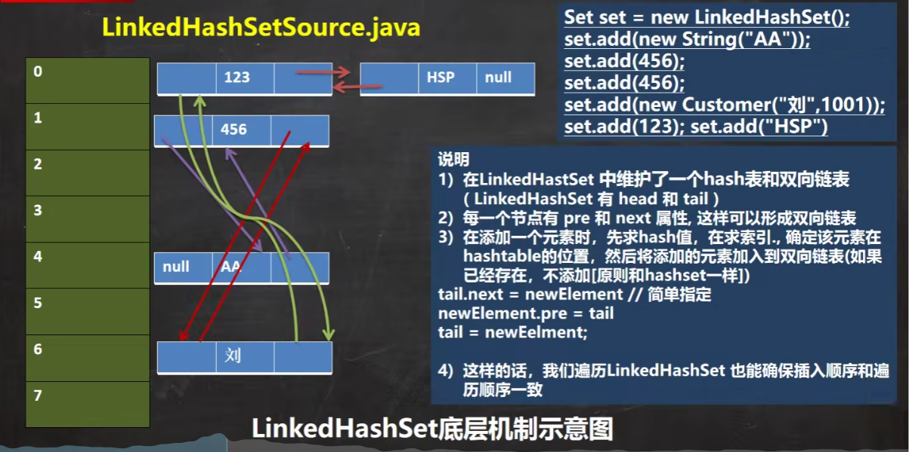
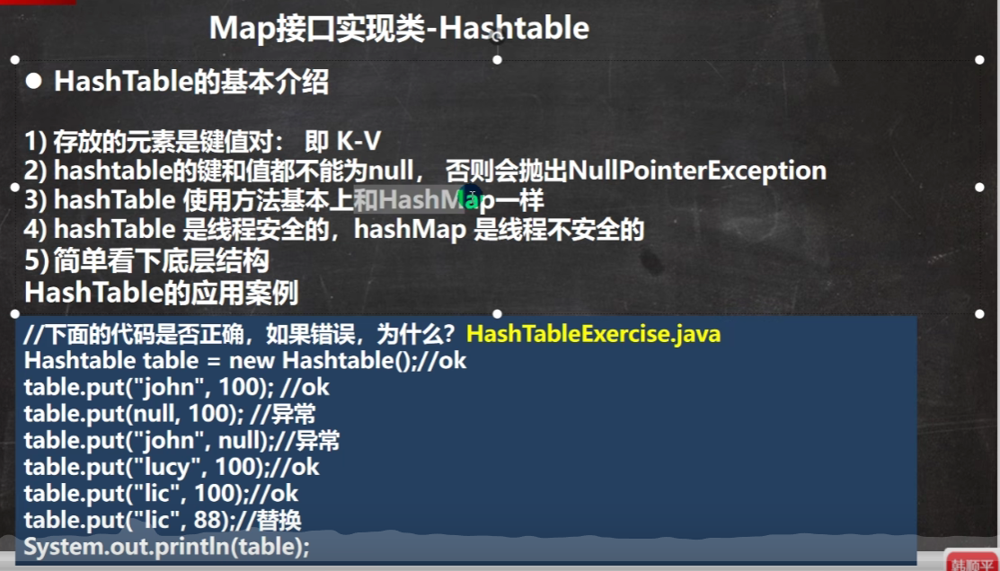

# Javase笔记 day12 集合

## 1. 集合介绍


## 2. Collection 单列集合

### 2.1 Collection接口


```java
import java.util.ArrayList;
import java.util.List;

/**
 * Collecting接口的常用方法
 */
public class CollectionDemo01Method {
    public static void main(String[] args) {
        List list = new ArrayList();
        // add 添加元素
        list.add(10);
        list.add(12);
        list.add("tom");
        list.add(true);
        list.add(20);
        list.add("jack");
        System.out.println(list);
        // remove 删除指定元素
        System.out.println("remove \t" + list.remove(true));
        System.out.println("remove \t" + list.remove(new Integer(12)));
        System.out.println("remove \t" + list.remove(new Integer(99)));// 删除不存在的,返回false
        System.out.println("remove \t" + list.remove(0));// 通过下标删除,下标0开始
        System.out.println(list);
        // contains 判断指定元素是否存在
        System.out.println("contains \t" + list.contains("tom"));
        System.out.println("contains \t" + list.contains("tom2"));
        // isEmpty 判断集合是否为空
        System.out.println("isEmpty \t" + list.isEmpty());
        // clear 清空集合的元素
        // list.clear();
        // System.out.println(list);

        //
        List list1 = new ArrayList();
        list1.add("h1");
        list1.add("h2");
        // addAll 将另一个集合的元素加到当前集合中
        list.addAll(list1);
        System.out.println("addAll \t" + list);
        // containsAll 判断另一个集合的元素是否全部在当前集合中
        System.out.println("containsAll \t" + list.containsAll(list1));
        // removeAll 将另一个集合的元素从当前集合中移除
        list.removeAll(list1);
        System.out.println("removeAll \t" + list);

    }
}
```


```java
import java.util.ArrayList;
import java.util.Iterator;
import java.util.List;

/**
 * Collecting接口的常用方法
 */
public class CollectionDemo01CollectionMethod {
    public static void main(String[] args) {
        List list = new ArrayList();
        // add 添加元素
        list.add(10);
        list.add(12);
        list.add("tom");
        list.add(true);
        list.add(20);
        // iterator 迭代器
        Iterator iterator = list.iterator();
        while (iterator.hasNext()) {
            Object obj = iterator.next();
            System.out.println("list value= " + obj);
        }
        // 循环结束后指针已经到最后了,无法再继承操作了,需要重新获取迭代器.
        Iterator iterator1 = list.iterator();

        // 增强for循环(底层是调用的iterator迭代器) 集合
        for (Object o : list) {
            System.out.println("增强for循环 " + o);
        }
        // 增强for循环 数组
        int[] arr = {2, 4, 5, 6, 0};
        for (int i : arr) {
            System.out.println(i);
        }
    }
}
```

### 2.2 List接口


```java
import java.util.ArrayList;
import java.util.Iterator;
import java.util.List;

/**
 * List接口的常用方法
 * List 是有序的可重复集合
 */
public class CollectionDemo02List {
    @SuppressWarnings("all")
    public static void main(String[] args) {
        /**
         * List 常用方法
         */
        List list = new ArrayList();
        list.add("tom");
        list.add("jack");
        list.add("f4");
        System.out.println("list基本元素: \t" + list);
        // add 添加元素
        list.add("addE1");
        list.add(2, "addE2");// 指定下标 插入元素
        System.out.println("list: \t" + list);
        // addAll 添加集合元素
        List list1 = new ArrayList();
        list1.add("newL1");
        list1.add("newL2");
        list.addAll(list1);
        System.out.println("list: \t" + list);
        list.addAll(0, list1);
        System.out.println("list: \t" + list);// 指定位置 插入元素
        // get 获取指定下标位置元素
        System.out.println("get获取指定下标位置元素: \t" + list.get(0));
        // indexOf 返回目标元素的第一个下标
        System.out.println("indexOf \t" + list.indexOf("newL1"));
        // lastIndexOf 返回目标元素的最后一个下标
        System.out.println("lastIndexOf \t" + list.lastIndexOf("newL1"));
        // remove 移除指定下标的元素，并返回boolean
        System.out.println("remove \t" + list.remove("tom"));
        System.out.println("remove \t" + list.remove("tom22"));
        System.out.println("list: \t" + list);
        // set 替换指定下标的元素
        list.set(1, "setElement");
        System.out.println("list: \t" + list);
        // subList 返回一个下标范围内[startIndex, endIndex) 的子集合
        List subList = list.subList(2, 4);// 返回下标是 2-3的元素
        System.out.println("subList: \t" + subList);

        /**
         * List 遍历方式
         *   1.iterator迭代器
         *   2.增强for循环
         *   3.使用普通for循环
         */
        System.out.println("List 遍历方式----------------");
        List list2 = new ArrayList();
        list2.add("tom");
        list2.add("jack");
        list2.add("f4");
        // iterator
        Iterator iterator = list2.iterator();
        while (iterator.hasNext()) {
            Object next =  iterator.next();
            System.out.println("iterator \t" + next);
        }
        // 增强for循环
        for (Object o : list2) {
            System.out.println("增强for循环 \t" + o);
        }
        // 普通for循环
        for (int i = 0; i < list2.size(); i++) {
            Object o = list2.get(i);
            System.out.println("普通for循环 \t" + o);
        }

    }
}
```

### 2.3 ArrayList


```java
package com.hzwxdf.javase.day12.collection;

import java.util.ArrayList;

/**
 * List接口的子类 ArrayList
 *   1.ArrayList是线程不安全(效率高)
 */
public class CollectionDemo03ArrayList {
    @SuppressWarnings("all")
    public static void main(String[] args) {
        /**
         * ArrayList源码解析(无参构造器)
         * 1. 使用ArrayList的无参构造器创建一个空容量的 elementData (ArrayList内部存放数据的属性)
         * 2. 使用 Integer.valueof 将 i 进行自动装箱成Integer对象
         * 3. 调用add方法添加元素
         *      public boolean add(E e) {
         *         ensureCapacityInternal(size + 1);                           //源码解析：在这里确认容量是否足够
         *         elementData[size++] = e;
         *         return true;
         *      }
         * 4. 调用 ensureCapacityInternal 方法确认ArrayList的容量是否足够
         *      private void ensureCapacityInternal(int minCapacity) {
         *         if (elementData == DEFAULTCAPACITY_EMPTY_ELEMENTDATA) {     //源码解析：这里看elementData是否是空数组
         *             minCapacity = Math.max(DEFAULT_CAPACITY, minCapacity);  //源码解析：elementData为空就将默认大小(10)和当前所需大小中最大值赋给minCapacity
         *         }
         *
         *         ensureExplicitCapacity(minCapacity);                        //源码解析：这里确认是否要扩容
         *      }
         *
         * 5. 调用 ensureExplicitCapacity 方法确认是否需要扩容
         *      private void ensureExplicitCapacity(int minCapacity) {
         *         modCount++;                                                //源码解析：防止多线程问题，记录修改次数
         *
         *         // overflow-conscious code
         *         if (minCapacity - elementData.length > 0)                  //源码解析：如果当前所需大小超过既存 elementData 的大小则进行扩容
         *             grow(minCapacity);
         *      }
         * 6. 调用 grow 方法进行扩容
         *      private void grow(int minCapacity) {
         *         // overflow-conscious code
         *         int oldCapacity = elementData.length;                     //源码解析：记录下旧容量
         *         int newCapacity = oldCapacity + (oldCapacity >> 1);       //源码解析：记录下扩容后的容量(第一次为0,后续的扩容都是 旧容量的 1.5倍)
         *         if (newCapacity - minCapacity < 0)                        //源码解析：如果扩容后的容量 - 旧容量 还小于0，则给扩容后的容量赋初始容量10(只有第一次时会执行)
         *             newCapacity = minCapacity;                            //源码解析：第一次时扩容为 10
         *         if (newCapacity - MAX_ARRAY_SIZE > 0)                     //源码解析：如果扩容后容量大于数组大小的最大值，则对容量进行重新赋值。
         *             newCapacity = hugeCapacity(minCapacity);              //源码解析：内部逻辑是 (minCapacity > MAX_ARRAY_SIZE) ? Integer.MAX_VALUE : MAX_ARRAY_SIZE;
         *         // minCapacity is usually close to size, so this is a win:
         *         elementData = Arrays.copyOf(elementData, newCapacity);    //源码解析： 这里使用 Arrays.copyOf 对就数组进行扩容。
         *      }
         * 7. 扩容结束后，方法一层层返回到 第三步中的add方法进行元素的添加。
         *      public boolean add(E e) {
         *         ensureCapacityInternal(size + 1);  // Increments modCount!!
         *         elementData[size++] = e;                                 //源码解析： 这里将元素添加到扩容后的数组中
         *         return true;
         *      }
         */
        ArrayList arrayList = new ArrayList();// 第一次扩容
        for (int i = 1; i <= 10; i++) {
            arrayList.add(i);
        }
        for (int i = 11; i <= 15; i++) {
            arrayList.add(i);
        }
        arrayList.add(100);
        arrayList.add(200);
        arrayList.add(null);

        /**
         * ArrayList源码解析(指定容量大小的构造器)
         * 1. 使用指定容量的构造器创建ArrayList
         *      public ArrayList(int initialCapacity) {
         *         if (initialCapacity > 0) {
         *             this.elementData = new Object[initialCapacity];
         *         } else if (initialCapacity == 0) {
         *             this.elementData = EMPTY_ELEMENTDATA;
         *         } else {
         *             throw new IllegalArgumentException("Illegal Capacity: "+
         *                                                initialCapacity);
         *         }
         *      }
         * 2. 接下来就是调用Integer自动装箱和add方法进行元素添加了，具体源码可以看 ArrayList源码解析(无参构造器) 2-7
         */
        ArrayList arrayList2 = new ArrayList(4);// 第一次扩容
        for (int i = 1; i <= 4; i++) {
            arrayList2.add(i);
        }
        for (int i = 5; i <= 6; i++) {
            arrayList2.add(i);
        }
        arrayList2.add(100);
        arrayList2.add(200);
        arrayList2.add(null);
    }
}
```

### 2.4 Vector


```java
import java.util.Vector;

/**
 * List接口的子类 Vector
 *   1.Vector是线程安全的(效率不高)
 */
public class CollectionDemo04Vector {
    @SuppressWarnings("all")
    public static void main(String[] args) {
        /**
         * Vector源码解析(无参构造器)
         * 1. 使用无参构造器创建Vector对象，这里的容量为10
         *     public Vector() {
         *         this(10);
         *     }
         * 2. int的自动装箱(省略)和使用add方法添加元素
         *     public synchronized boolean add(E e) {
         *         modCount++;                                                        //源码解析：防止多线程，记录修改次数
         *         ensureCapacityHelper(elementCount + 1);                            //源码解析：确认所需容量是否足够，是否需要扩容
         *         elementData[elementCount++] = e;
         *         return true;
         *     }
         * 3. 使用 ensureCapacityHelper 方法确认容量是否足够
         *     private void ensureCapacityHelper(int minCapacity) {
         *         // overflow-conscious code
         *         if (minCapacity - elementData.length > 0)                          //源码解析：如果所需容量超过既存的elementData的大小，则进行扩容
         *             grow(minCapacity);                                             //源码解析：调用grow方法进行扩容
         *     }
         * 4. 调用 grow 方法进行扩容
         *     private void grow(int minCapacity) {
         *         // overflow-conscious code
         *         int oldCapacity = elementData.length;                              //源码解析：记录既存的容量大小
         *         int newCapacity = oldCapacity + ((capacityIncrement > 0) ?         //源码解析：扩容关键点，这里看构造器中是否指定了增量，没指定增量就直接2倍扩容
         *                                          capacityIncrement : oldCapacity); //        如果构造器中指定了增量，那么扩容就是 既存的容量大小+增量
         *         if (newCapacity - minCapacity < 0)                                 //源码解析：扩容后容量比所需容量小的话，扩容容量直接用所需容量
         *             newCapacity = minCapacity;
         *         if (newCapacity - MAX_ARRAY_SIZE > 0)                              //源码解析：扩容后容量超过限制的话，扩容容量需要重新设置。
         *             newCapacity = hugeCapacity(minCapacity);                       //源码解析：内部逻辑是 (minCapacity > MAX_ARRAY_SIZE) ? Integer.MAX_VALUE : MAX_ARRAY_SIZE;
         *         elementData = Arrays.copyOf(elementData, newCapacity);             //源码解析： 这里使用 Arrays.copyOf 对就数组进行扩容。
         *     }
         * 5. 扩容结束后，方法一层层返回到 第二步中的add方法进行元素的添加。
         *     public synchronized boolean add(E e) {
         *         modCount++;
         *         ensureCapacityHelper(elementCount + 1);
         *         elementData[elementCount++] = e;                                  //源码解析： 这里将元素添加到扩容后的数组中
         *         return true;
         *     }
         */
        Vector vector = new Vector();// 每次扩容是在10乘以2
        for (int i = 1; i <= 10; i++) {
            vector.add(10);
        }
        vector.add(100);

        /**
         * Vector源码解析(指定容量大小的有参构造器)
         *   请查看无参构造器的分析，两者只是构造器处理不太一样
         *   1.构造器
         *      public Vector(int initialCapacity) {
         *         this(initialCapacity, 0);
         *      }
         */
        Vector vector1 = new Vector(4);// 每次扩容是在原来的基础4乘以2
        for (int i = 1; i <= 4; i++) {
            vector1.add(10);
        }
        vector1.add(100);

        /**
         * Vector源码解析(指定容量大小和扩容时的增量的有参构造器)
         *   请查看无参构造器的分析，两者只是构造器处理不太一样
         *   1.构造器
         *      public Vector(int initialCapacity, int capacityIncrement) {
         *         super();
         *         if (initialCapacity < 0)
         *             throw new IllegalArgumentException("Illegal Capacity: "+
         *                                                initialCapacity);
         *         this.elementData = new Object[initialCapacity];
         *         this.capacityIncrement = capacityIncrement;
         *      }
         */
        Vector vector2 = new Vector(4, 2);// 每次扩容是在原来的基础4上加2
        for (int i = 1; i <= 4; i++) {
            vector2.add(10);
        }
        vector2.add(101);
        vector2.add(101);
        vector2.add(201);
    }
}
```

### 2.5 LinkedList


```java
import java.util.LinkedList;

/**
 * List接口的子类 LinkedList
 *   1.LinkedList是线程不安全的(效率高)
 *   2.LinkedList的底层是双向链表(增删搞笑)
 */
public class CollectionDemo05LinkedList {
    public static void main(String[] args) {
        /**
         * LinkedList源码解析 add
         *   LinkedList内部有 first 和 last 两个节点属性(节点：item(值)、prev(前一个节点)、next(后一个节点))
         * 1.使用无参构造器创建LinkedList对象。
         *     public LinkedList() {
         *     }
         * 2.使用 add 方法添加元素(Integer自动装箱)
         *     public boolean add(E e) {
         *         linkLast(e);                                       //源码解析：使用 linkLast 方法添加元素
         *         return true;
         *     }
         * 3.使用 linkLast 方法添加元素
         *     void linkLast(E e) {
         *         final Node<E> l = last;                            //源码解析：将last节点赋给l，此时l代表原来的最后一个节点。 (第一次时 last 和 first 为 null)
         *         final Node<E> newNode = new Node<>(l, e, null);    //源码解析：创建一个新节点，新节点的prev=l, item=e, next=null。
         *         last = newNode;                                    //源码解析：让新节点成为新的最后一个节点。
         *         if (l == null)                                     //源码解析：如果原来的最后一个节点l是 null。那么 first节点也是新节点
         *             first = newNode;
         *         else                                               //源码解析：如果原来的最后一个节点l不是 null。那么 原来的最后一个节点的next就指向新节点
         *             l.next = newNode;
         *         size++;                                            //源码解析：集合的size增加
         *         modCount++;                                        //源码解析：集合的操作次数增加
         *     }
         * 4. 方法最后返回
         */
        LinkedList linkedList = new LinkedList();
        linkedList.add(1);
        linkedList.add(2);
        System.out.println("add后的集合: " + linkedList);

        /**
         * LinkedList源码解析 remove
         *   LinkedList内部有 first 和 last 两个节点属性(节点：item(值)、prev(前一个节点)、next(后一个节点))
         * 1.使用无参构造器创建LinkedList对象。
         * 2.使用remove()方法删除第一个元素。
         *     public E remove() {
         *         return removeFirst();                          //源码解析：调用 removeFirst 方法删除第一个元素
         *     }
         * 3.调用 removeFirst 方法删除第一个元素。
         *     public E removeFirst() {
         *         final Node<E> f = first;                      //源码解析：获取第一个节点元素
         *         if (f == null)
         *             throw new NoSuchElementException();
         *         return unlinkFirst(f);                        //源码解析：调用 unlinkFirst 方法删除第一个元素
         *     }
         * 4.调用 unlinkFirst 方法删除第一个元素。
         *     private E unlinkFirst(Node<E> f) {
         *         // assert f == first && f != null;
         *         final E element = f.item;                    //源码解析：将旧第一个节点元素的item赋给 element
         *         final Node<E> next = f.next;                 //源码解析：将旧第一个节点元素的next指向赋给 next
         *         f.item = null;                               //源码解析：删除旧第一个节点元素的 item
         *         f.next = null; // help GC                    //源码解析：删除旧第一个节点元素的 next指向
         *         first = next;                                //源码解析：让旧的第一个节点元素的 next指向的节点成为 新的第一个元素
         *         if (next == null)                            //源码解析：如果旧的第一个元素的next指向是null，说明该节点是集合中唯一一个节点，
         *             last = null;                             //        如果该节点被删除，那么集合的last指向也需要被删除
         *         else                                         //源码解析： 如果旧的第一个元素的next指向不是null，说明该集合中还存在其他多个节点，
         *             next.prev = null;                        //         需要将旧第一个节点元素的next指向的节点变成集合的新的第一个节点。
         *         size--;
         *         modCount++;
         *         return element;
         *     }
         */
        linkedList.remove();
        System.out.println("remove后的集合: " + linkedList);

        // 集合修改
        /**
         * 1.set方法源码
         *     public E set(int index, E element) {
         *         checkElementIndex(index);
         *         Node<E> x = node(index);
         *         E oldVal = x.item;
         *         x.item = element;
         *         return oldVal;
         *     }
         */
        linkedList.set(0, 200);
        System.out.println("set后的集合: " + linkedList);

        // get 集合获取
        /**
         * 1.get方法源码
         *     public E get(int index) {
         *         checkElementIndex(index);
         *         return node(index).item;
         *     }
         */
        System.out.println("get获取的元素: " + linkedList.get(0));
        System.out.println("getFirst获取的元素: " + linkedList.getFirst());
        System.out.println("getLast获取的元素: " + linkedList.getLast());
    }
}
```


### 2.5 Set接口


```java
import java.util.HashSet;
import java.util.Iterator;
import java.util.Set;

/**
 * Set接口的常用方法
 * Set 是无序的不可重复集合
 */
public class CollectionDemo05Set {
    @SuppressWarnings("all")
    public static void main(String[] args) {
        /**
         * Set 基本介绍
         *  1.set集合取出顺序表不是按照存入顺序来的。但是取出顺序是固定的
         */
        Set set = new HashSet();
        set.add("tom");
        set.add("tom");// 多个相同元素只会存一个
        set.add("jack");
        set.add("mana");
        set.add(null);
        set.add(null);// 可以存 null
        System.out.println("第一次取出顺序: \t" + set);
        System.out.println("第二次取出顺序: \t" + set);
        System.out.println("第三次取出顺序: \t" + set);

        /**
         * Set 遍历
         *   1.iterator
         *   2.增强for循环
         */
        Iterator iterator = set.iterator();
        while (iterator.hasNext()) {
            Object next =  iterator.next();
            System.out.println("iterator: \t" + next);
        }
        for (Object o : set) {
            System.out.println("增强for循环: \t" + o);
        }

        /**
         * Set 部分常用方法说明
         */
        set.remove(null);
        set.clear();
    }
}
```

### 2.6 HashSet


```java
import java.util.HashSet;

/**
 * HashSet
 *   1.无序,即存放顺序和取出顺序不一致
 *   2.不能有重复元素
 *   3.只能有一个null
 */
public class CollectionDemo06HashSet {
    @SuppressWarnings("all")
    public static void main(String[] args) {
        /**
         * HashSet源码解析----创建 HashSet
         * 1. 创建 HashSet (底层是 HashMap)
         *     public HashSet() {
         *         map = new HashMap<>();
         *     }
         */
        HashSet set = new HashSet();
        /**
         * HashSet源码解析----使用 add 添加元素
         * 1. 使用 add 添加元素
         *     public boolean add(E e) {
         *         return map.put(e, PRESENT)==null;  //源码解析： PRESENT是一个空Object，为了占位的 private static final Object PRESENT = new Object();
         *     }
         * 2. 使用 put 方法添加元素，k是存入元素 "java"，v是 PRESENT(占位空Object)
         *     public V put(K key, V value) {
         *         return putVal(hash(key), key, value, false, true);
         *     }
         * 3. 使用 hash 方法计算出 hash值。
         *     static final int hash(Object key) {
         *         int h;
         *         return (key == null) ? 0 : (h = key.hashCode()) ^ (h >>> 16); //源码解析： 底层使用的是元素的 hashCode() 方法来计算
         *     }
         * 4. hash值计算出来后，使用 putVal 方法添加元素。hash是第3步中计算出的hash值，k是存入元素 "java"，v是 PRESENT(占位空Object)
         *     final V putVal(int hash, K key, V value, boolean onlyIfAbsent,
         *                    boolean evict) {
         *         //源码解析： 这里定义了临时变量
         *         Node<K,V>[] tab; Node<K,V> p; int n, i;
         *         //源码解析： 如果 table 为空，或者 table 的长度为0，那么就调用resize 方法初始化表
         *         //  resize方法内 创建了一个 默认大小为 16(static final int DEFAULT_INITIAL_CAPACITY = 1 << 4 = 16) 的 Node[],
         *         //  而且还根据加载因子 (DEFAULT_LOAD_FACTOR = 0.75f) 设置了 HashMap的扩容临界值=12 (int)(DEFAULT_LOAD_FACTOR * DEFAULT_INITIAL_CAPACITY)
         *         if ((tab = table) == null || (n = tab.length) == 0)
         *             n = (tab = resize()).length;
         *         //源码解析： 更加key的hash计算出 该元素的 索引位置，并把该元素的对象地址赋给p
         *         // 如果p == null，那么就创建一个节点并赋给该索引位置
         *         if ((p = tab[i = (n - 1) & hash]) == null)
         *             tab[i] = newNode(hash, key, value, null);
         *         else {
         *             //源码解析： else 这里是只有 要添加元素的下标位置已经存在元素时 才会执行的逻辑，需要将添加元素放到该下标的链表后面。
         *             //源码解析： 这里定义了临时变量
         *             Node<K,V> e; K k;
         *             //源码解析： 既存元素和要添加元素的hash值相同 并且 (两个元素的对象地址相同 或者 两个对象的内容相同)时，将 p(既存元素对象地址) 赋值给 e
         *             if (p.hash == hash &&
         *                 ((k = p.key) == key || (key != null && key.equals(k))))
         *                 e = p;
         *             //源码解析： 如果既存元素是红黑树，那么调用红黑树的添加元素方法。红黑树比较复杂这里暂时不深入
         *             else if (p instanceof TreeNode)
         *                 e = ((TreeNode<K,V>)p).putTreeVal(this, tab, hash, key, value);
         *             else {
         *                 //源码解析： else 这里是循环比较一个索引位置下所有链表元素，看看是否已经存在，不存在就添加到链表后面
         *                 for (int binCount = 0; ; ++binCount) {
         *                     //源码解析：如果该该索引位置只有一个元素，那么要添加元素直接添加到链表后面。
         *                     if ((e = p.next) == null) {
         *                         p.next = newNode(hash, key, value, null);
         *                         //源码解析：如果链表元素个数大于等于 8，那么就调用 treeifyBin 方法将数据结构转成红黑树
         *                         //  细节1：如果数组大小小于 64，那么该方法会执行数组扩容，不会转红黑树
         *                         //  细节2：如果数组大小 大于等于64，那么该方法会转红黑树
         *                         if (binCount >= TREEIFY_THRESHOLD - 1) // -1 for 1st
         *                             treeifyBin(tab, hash);
         *                         break;
         *                     }
         *                     //源码解析： 既存元素链表的下一个元素和要添加元素的hash值相同 并且 (两个元素的对象地址相同 或者 两个对象的内容相同)时，将 p(既存元素对象地址) 赋值给 e
         *                     //源码解析： 说明存在相同元素，跳出循环。
         *                     if (e.hash == hash &&
         *                         ((k = e.key) == key || (key != null && key.equals(k))))
         *                         break;
         *                     p = e;
         *                 }
         *             }
         *             if (e != null) { // existing mapping for key
         *                 V oldValue = e.value;
         *                 if (!onlyIfAbsent || oldValue == null)
         *                     e.value = value;
         *                 afterNodeAccess(e);
         *                 return oldValue;
         *             }
         *         }
         *         ++modCount;                   //源码解析： 修改次数增加
         *         if (++size > threshold)       //源码解析： 如果HashMap的大小超过了扩容临界值，那么就调用resize方法进行扩容。
         *             resize();
         *         afterNodeInsertion(evict);
         *         return null;
         *     }
         * 5.添加成功返回 null,然后返回到add方法判断返回是否为null，为null就代表超过添加元素。
         */
        set.add("java");
        set.add("php");
        set.add("java");
        System.out.println("set=" + set);
    }
}
```


### 2.7 LinkedHashSet




```java
import java.util.LinkedHashSet;

/**
 * LinkedHashSet
 * 1.有序的(数组+双向链表实现)，即存入顺序和取出顺序一致。
 * 2.不能有重复元素
 * 3.只能有一个null
 */
public class CollectionDemo07LinkedHashSet {
    public static void main(String[] args) {
        /**
         * 源码解析
         * 1.创建对象
         *     public LinkedHashSet() {
         *         super(16, .75f, true);
         *     }
         * 2. super的构造器
         *     HashSet(int initialCapacity, float loadFactor, boolean dummy) {
         *         map = new LinkedHashMap<>(initialCapacity, loadFactor);
         *     }
         */
        LinkedHashSet linkedHashSet = new LinkedHashSet();
        /**
         * 源码解析
         * 1.元素添加
         *     public boolean add(E e) {
         *         return map.put(e, PRESENT)==null;
         *     }
         * 2.map的put方法已经解析过了，省略
         */
        linkedHashSet.add("tom1");
        linkedHashSet.add("tom2");
        linkedHashSet.add("tom1");
        linkedHashSet.add("tom3");
        System.out.println("LinkedHashSet= " + linkedHashSet);

    }
}
```

### 2.8 TreeSet

Java中TreeSet的特点包括:

1. TreeSet是一个有序集合，它根据元素的自然顺序进行排序，或者根据指定的Comparator进行排序。

2. TreeSet不允许重复元素。如果将重复元素添加到TreeSet中，则只会保留一个元素，并且不会抛出异常。

3. TreeSet提供了高效的插入、删除和查找操作。

4. TreeSet是基于红黑树（一种自平衡二叉搜索树）实现的，因此它可以快速地进行范围查询（如获取给定范围内的元素）。

5. TreeSet实现了NavigableSet接口，因此它提供了许多方便的方法，如获取第一个元素、获取最后一个元素、获取小于/大于给定元素的最接近的元素等。

```java
import java.util.Comparator;
import java.util.TreeSet;

/**
 * TreeSet
 *  有序的set集合，底层是TreeMap
 */
public class CollectionDemo08TreeSet {
    @SuppressWarnings({"all"})
    public static void main(String[] args) {
        /**
         * TreeSet 源码分析
         * 1.使用无参构造器创建对象
         *     public TreeSet() {
         *         this(new TreeMap<E,Object>());
         *     }
         * 2.调用有参构造器创建对象，并初始化m TreeMap
         *     TreeSet(NavigableMap<E,Object> m) {
         *         this.m = m;
         *     }
         */
        TreeSet treeSet = new TreeSet();
        /**
         * 1.使用 add 方法添加元素
         *     public boolean add(E e) {
         *         return m.put(e, PRESENT)==null;
         *     }
         * 2.调用map的 put 方法添加元素，key就是添加元素，value是固定值  private static final Object PRESENT = new Object()
         *     public V put(K key, V value) {
         *         // 源码解析: root是红黑树的根节点，第一次是null
         *         Entry<K,V> t = root;
         *         if (t == null) {
         *             // 源码解析: 这里调用比较器进行比较(分两种)
         *             //   一种是实现元素自身实现了comparable接口，并复写了compareTo方法
         *             //   另一种是TreeSet创建时手动传入一个比较器Comparator,并复写compare方法。
         *             //      final int compare(Object k1, Object k2) {
         *             //         return comparator==null ? ((Comparable<? super K>)k1).compareTo((K)k2)
         *             //          : comparator.compare((K)k1, (K)k2);
         *             //      }
         *             compare(key, key); // type (and possibly null) check
         *             // 这里新建一个红黑树节点，然后将其置为根节点。并更新大小、记录操作次数，最后返回null
         *             root = new Entry<>(key, value, null);
         *             size = 1;
         *             modCount++;
         *             return null;
         *         }
         *         int cmp;
         *         Entry<K,V> parent;
         *         // split comparator and comparable paths
         *         //源码分析： 如果是第二次进入这里，那么下面部分的代码会执行，根据不同比较器执行调用不同的比较方法。
         *         Comparator<? super K> cpr = comparator;
         *         if (cpr != null) {
         *             do {
         *                 parent = t;
         *                 cmp = cpr.compare(key, t.key);
         *                 if (cmp < 0)
         *                     t = t.left;
         *                 else if (cmp > 0)
         *                     t = t.right;
         *                 else
         *                     return t.setValue(value);
         *             } while (t != null);
         *         }
         *         else {
         *             if (key == null)
         *                 throw new NullPointerException();
         *             @SuppressWarnings("unchecked")
         *                 Comparable<? super K> k = (Comparable<? super K>) key;
         *             do {
         *                 parent = t;
         *                 cmp = k.compareTo(t.key);
         *                 if (cmp < 0)
         *                     t = t.left;
         *                 else if (cmp > 0)
         *                     t = t.right;
         *                 else
         *                     return t.setValue(value);
         *             } while (t != null);
         *         }
         *         Entry<K,V> e = new Entry<>(key, value, parent);
         *         if (cmp < 0)
         *             parent.left = e;
         *         else
         *             parent.right = e;
         *         fixAfterInsertion(e);
         *         size++;
         *         modCount++;
         *         return null;
         *     }
         */
        treeSet.add("a1");
        treeSet.add("b1");
        treeSet.add("c1");
        treeSet.add("tom");
        treeSet.add("cat");
        System.out.println(treeSet);

        /**
         * TreeSet 排序演示
         */
        TreeSet treeSet1 = new TreeSet(new Comparator() {
            @Override
            public int compare(Object o1, Object o2) {
                String a1 = (String)o1;
                String a2 = (String)o2;
                return a1.compareTo(a2);
            }
        });
        treeSet1.add("tom");
        treeSet1.add("akari");
        treeSet1.add("cat");
        System.out.println("传入comparator接口的比较器:" + treeSet1);

        TreeSet treeSet2 = new TreeSet();
        treeSet2.add(new CollectionDemo08A("aa"));
        treeSet2.add(new CollectionDemo08A("b"));
        treeSet2.add(new CollectionDemo08A("dafa"));
        System.out.println("对象实现comparable接口:" + treeSet1);
    }
}
class CollectionDemo08A implements Comparable {
    private String name;

    public CollectionDemo08A(String name) {
        this.name = name;
    }

    public String getName() {
        return name;
    }

    public void setName(String name) {
        this.name = name;
    }

    @Override
    public int compareTo(Object o) {
        CollectionDemo08A a2 = (CollectionDemo08A)o;
        return this.getName().length() - a2.getName().length();
    }
}
```

## 3. Map接口

### 3.1 Map接口基本介绍


```java
import java.util.*;

/**
 * Map接口
 *
 */
public class MapDemo01Map {
    public static void main(String[] args) {
        /**
         * Map接口特点
         * map接口的 key 和 value都是 Hash$Node。
         * 为了方便遍历map，又将 key 和 value 封装到 Entry 中，在把所有的Entry放到一个Set集合中，即属性 entrySet.
         */
        Map map = new HashMap();
        map.put("no1", "v1");
        map.put("no2", "v2");
        map.put("no1", "new v1");// 相同key，多次赋值，后面的值会替换前面的值。
        map.put(null, null);
        map.put(null, "new null");// key只能有一个null，value可以有多个null
        map.put("no3", null);
        System.out.println(map.get("no2"));

        /**
         * Map接口常用方法
         */
        Map map1 = new HashMap();
        // put 添加元素
        map1.put("k1", "v1");
        map1.put("k2", "v2");
        map1.put("k3", "v3");
        map1.put("k4", "v4");
        map1.put("k5", "v5");
        System.out.println(map1);
        // remove 删除元素
        map1.remove("k5");
        System.out.println(map1);
        // get 获取指定元素
        System.out.println(map1.get("k1"));
        // size 获取集合的大小
        System.out.println("集合大小: " + map1.size());
        // isEmpty 元素是否为空
        System.out.println(map1.isEmpty());
        System.out.println(new HashMap().isEmpty());
        // contains 指定key是否存在
        System.out.println(map1.containsKey("k1"));
        System.out.println(map1.containsKey("k9"));
        // clear 清空集合元素
        map1.clear();
        System.out.println(map1);

        /**
         * Map接口遍历\
         * 1.keySet
         * 2.entrySet
         * 3.values
         */
        System.out.println("-----------------Map接口遍历--------------------");
        Map map2 = new HashMap();
        for (int i = 1; i < 6; i++) {
            map2.put("k" + i, "v" + i);
        }
        // keySet
        Set keySet = map2.keySet();
        for (Object o : keySet) {
            String key = (String)o;
            String value = (String)map2.get(key);
            System.out.println("增强for " + key + "=" + value);
        }
        Iterator iterator = keySet.iterator();
        while (iterator.hasNext()) {
            String key = (String)iterator.next();
            String value = (String)map2.get(key);
            System.out.println("iterator " + key + "=" + value);
        }
        // values
        Collection values = map2.values();
        for (Object value : values) {
            System.out.println("value= " + value);
        }
        // entrySet
        Set entrySet = map2.entrySet();
        for (Object o : entrySet) {
            Map.Entry entry = (Map.Entry) o;
            System.out.println("增强for " + entry.getKey() + "=" + entry.getValue());
        }
        Iterator iterator1 = entrySet.iterator();
        while (iterator1.hasNext()) {
            Map.Entry entry = (Map.Entry) iterator1.next();
            System.out.println("iterator " + entry.getKey() + "=" + entry.getValue());
        }
    }
}
```

### 3.2 HashMap


```java
import java.util.HashMap;

/**
 * HashMap
 */
public class MapDemo02HashMap {
    public static void main(String[] args) {
        /**
         * HashMap 源码解析
         *   Map中的key和value都是 HashMap$Node
         * HashMap的属性说明：
         *   table:      这是保存元素的数组 Node<K,V>[]，用来保存元素的。
         *   loadFactor: 这是加载因子 float loadFactor，用于扩容时决定容量。
         *   threshold:  这是数组的临界值 int threshold，一旦到达临界值，就会根据加载因子进行扩容。
         *   entrySet：将key-value封装成Map.Entry,然后将所有元素放到Set集合中 Set<Map.Entry<K,V>> entrySet。
         *   modCount: 这是记录操作次数 int modCount，防止多线程。
         *   size: 这是记录map集合的大小 int size。
         */

        /**
         * 1.使用无参构造器创建对象，并初始化加载因子为0.75。其他属性都是默认值
         *     public HashMap() {
         *         this.loadFactor = DEFAULT_LOAD_FACTOR; // all other fields defaulted
         *     }
         *     加载因子的定义： static final float DEFAULT_LOAD_FACTOR = 0.75f
         */
        HashMap hashMap = new HashMap();
        /**
         * 1.使用 put 方法添加元素，这里有个 hash 方法，这是用来计算key的hash值的。
         *     public V put(K key, V value) {
         *         return putVal(hash(key), key, value, false, true);
         *     }
         * 2.使用 hash 方法计算key的hash值。key为空返回0，key不为空，则调用 hashCode方法获取hashCode值，再进行异或运行，并将结果返回。
         *     static final int hash(Object key) {
         *         int h;
         *         return (key == null) ? 0 : (h = key.hashCode()) ^ (h >>> 16);
         *     }
         * 3. key的hash值计算出来后，再返回步骤1的 putVal 方法，这该方法中进行元素添加。
         *     final V putVal(int hash, K key, V value, boolean onlyIfAbsent,
         *                    boolean evict) {
         *         // 源码解析：这里定义了一些临时变量
         *         Node<K,V>[] tab; Node<K,V> p; int n, i;
         *         // 源码解析：这里先将 HashMap的集合属性 table 赋给 临时变量 tab，
         *         // 然后判断 tab 是否null，以及 tab 的大小是否为0,这里是第一次进来，所以tab当前是 null,然后进入resize方法进行扩容。
         *         if ((tab = table) == null || (n = tab.length) == 0)
         *             n = (tab = resize()).length;
         *         if ((p = tab[i = (n - 1) & hash]) == null)
         *             tab[i] = newNode(hash, key, value, null);
         *         else {
         *             Node<K,V> e; K k;
         *             if (p.hash == hash &&
         *                 ((k = p.key) == key || (key != null && key.equals(k))))
         *                 e = p;
         *             else if (p instanceof TreeNode)
         *                 e = ((TreeNode<K,V>)p).putTreeVal(this, tab, hash, key, value);
         *             else {
         *                 for (int binCount = 0; ; ++binCount) {
         *                     if ((e = p.next) == null) {
         *                         p.next = newNode(hash, key, value, null);
         *                         if (binCount >= TREEIFY_THRESHOLD - 1) // -1 for 1st
         *                             treeifyBin(tab, hash);
         *                         break;
         *                     }
         *                     if (e.hash == hash &&
         *                         ((k = e.key) == key || (key != null && key.equals(k))))
         *                         break;
         *                     p = e;
         *                 }
         *             }
         *             if (e != null) { // existing mapping for key
         *                 V oldValue = e.value;
         *                 if (!onlyIfAbsent || oldValue == null)
         *                     e.value = value;
         *                 afterNodeAccess(e);
         *                 return oldValue;
         *             }
         *         }
         *         ++modCount;
         *         if (++size > threshold)
         *             resize();
         *         afterNodeInsertion(evict);
         *         return null;
         *     }
         * 4. 由于tab是null，所以调用 resize 方法进行扩容。
         *     final Node<K,V>[] resize() {
         *         // 源码解析： 下面这几个变量赋值操作，主要是记录原来的table(保存Node元素的数组)、capacity(容量)、threshold(扩容临界值)
         *         Node<K,V>[] oldTab = table;
         *         int oldCap = (oldTab == null) ? 0 : oldTab.length;
         *         int oldThr = threshold;
         *         int newCap, newThr = 0;
         *         // 源码解析：oldCap 由于是oldTab是null，所以是0，这里的if分支不会进去
         *         if (oldCap > 0) {
         *             if (oldCap >= MAXIMUM_CAPACITY) {
         *                 threshold = Integer.MAX_VALUE;
         *                 return oldTab;
         *             }
         *             else if ((newCap = oldCap << 1) < MAXIMUM_CAPACITY &&
         *                      oldCap >= DEFAULT_INITIAL_CAPACITY)
         *                 newThr = oldThr << 1; // double threshold
         *         }
         *         // 源码解析：由于原来的threshold没赋值默认是0，所以oldThr是0，这里的if分支也不不会进去
         *         else if (oldThr > 0) // initial capacity was placed in threshold
         *             newCap = oldThr;
         *         // 源码分析: 由于上面两个 if 都不满足，所以会进 else分支。
         *         else {               // zero initial threshold signifies using defaults
         *             // 源码分析: 这里给HashMap的容量和扩容临界值赋了初始值，容量是16,扩容临界值是 0.75 * 16 = 12
         *             newCap = DEFAULT_INITIAL_CAPACITY;
         *             newThr = (int)(DEFAULT_LOAD_FACTOR * DEFAULT_INITIAL_CAPACITY);
         *         }
         *         // 源码分析: 由于新的扩容临界值是12，所以这里的if不会进
         *         if (newThr == 0) {
         *             float ft = (float)newCap * loadFactor;
         *             newThr = (newCap < MAXIMUM_CAPACITY && ft < (float)MAXIMUM_CAPACITY ?
         *                       (int)ft : Integer.MAX_VALUE);
         *         }
         *         // 源码分析: 这里将新的扩容临界值正式应用到HashMap的属性threshold上。
         *         threshold = newThr;
         *         @SuppressWarnings({"rawtypes","unchecked"})
         *         // 源码分析: 这里利用新的容量创建了一个新的大小为16的Node数组，并将其应用到HashMap的table属性上。
         *             Node<K, V>[] newTab = (Node<K,V>[])new Node[newCap];
         *         table = newTab;
         *         // 源码分析: 这里由于旧的table是null，所以这里不会进。
         *         if (oldTab != null) {
         *             for (int j = 0; j < oldCap; ++j) {
         *                 Node<K,V> e;
         *                 if ((e = oldTab[j]) != null) {
         *                     oldTab[j] = null;
         *                     if (e.next == null)
         *                         newTab[e.hash & (newCap - 1)] = e;
         *                     else if (e instanceof TreeNode)
         *                         ((TreeNode<K,V>)e).split(this, newTab, j, oldCap);
         *                     else { // preserve order
         *                         Node<K,V> loHead = null, loTail = null;
         *                         Node<K,V> hiHead = null, hiTail = null;
         *                         Node<K,V> next;
         *                         do {
         *                             next = e.next;
         *                             if ((e.hash & oldCap) == 0) {
         *                                 if (loTail == null)
         *                                     loHead = e;
         *                                 else
         *                                     loTail.next = e;
         *                                 loTail = e;
         *                             }
         *                             else {
         *                                 if (hiTail == null)
         *                                     hiHead = e;
         *                                 else
         *                                     hiTail.next = e;
         *                                 hiTail = e;
         *                             }
         *                         } while ((e = next) != null);
         *                         if (loTail != null) {
         *                             loTail.next = null;
         *                             newTab[j] = loHead;
         *                         }
         *                         if (hiTail != null) {
         *                             hiTail.next = null;
         *                             newTab[j + oldCap] = hiHead;
         *                         }
         *                     }
         *                 }
         *             }
         *         }
         *         // 源码解析： 最后将新的Node数组返回
         *         return newTab;
         *     }
         * 5. resize方法将新的Node数组返回，并赋值给tab。
         *    final V putVal(int hash, K key, V value, boolean onlyIfAbsent,
         *                    boolean evict) {
         *         Node<K,V>[] tab; Node<K,V> p; int n, i;
         *         if ((tab = table) == null || (n = tab.length) == 0)
         *             //源码解析： 将新的Node数组赋值给tab，并将新数组大小赋值给临时变量 n
         *             n = (tab = resize()).length;
         *         //源码解析：这里利用table的最大下标 与 运算 key的hash值得到，当前key元素在Node数组table中的下标
         *         // 并将该下标所在位置的元素赋值给临时变量p，并判断该元素是否为null，为null就代表该下标位置没有存放元素，
         *         // 可以直接将当前key元素存放进去。
         *         if ((p = tab[i = (n - 1) & hash]) == null)
         *             tab[i] = newNode(hash, key, value, null);
         *         else {
         *             Node<K,V> e; K k;
         *             if (p.hash == hash &&
         *                 ((k = p.key) == key || (key != null && key.equals(k))))
         *                 e = p;
         *             else if (p instanceof TreeNode)
         *                 e = ((TreeNode<K,V>)p).putTreeVal(this, tab, hash, key, value);
         *             else {
         *                 for (int binCount = 0; ; ++binCount) {
         *                     if ((e = p.next) == null) {
         *                         p.next = newNode(hash, key, value, null);
         *                         if (binCount >= TREEIFY_THRESHOLD - 1) // -1 for 1st
         *                             treeifyBin(tab, hash);
         *                         break;
         *                     }
         *                     if (e.hash == hash &&
         *                         ((k = e.key) == key || (key != null && key.equals(k))))
         *                         break;
         *                     p = e;
         *                 }
         *             }
         *             if (e != null) { // existing mapping for key
         *                 V oldValue = e.value;
         *                 if (!onlyIfAbsent || oldValue == null)
         *                     e.value = value;
         *                 afterNodeAccess(e);
         *                 return oldValue;
         *             }
         *         }
         *         ++modCount;
         *         if (++size > threshold)
         *             resize();
         *         afterNodeInsertion(evict);
         *         return null;
         *     }
         * 6.调用 newNode 方法创建存放的Node元素。
         *     Node<K,V> newNode(int hash, K key, V value, Node<K,V> next) {
         *         return new Node<>(hash, key, value, next);
         *     }
         * 7.将创建的 Node元素赋值给 对应的下标位置，并继续处理
         *     final V putVal(int hash, K key, V value, boolean onlyIfAbsent,
         *                    boolean evict) {
         *         Node<K,V>[] tab; Node<K,V> p; int n, i;
         *         if ((tab = table) == null || (n = tab.length) == 0)
         *             n = (tab = resize()).length;
         *         if ((p = tab[i = (n - 1) & hash]) == null)
         *             //源码解析： 将创建的Node元素赋值给该下标。
         *             tab[i] = newNode(hash, key, value, null);
         *         else {
         *             Node<K,V> e; K k;
         *             if (p.hash == hash &&
         *                 ((k = p.key) == key || (key != null && key.equals(k))))
         *                 e = p;
         *             else if (p instanceof TreeNode)
         *                 e = ((TreeNode<K,V>)p).putTreeVal(this, tab, hash, key, value);
         *             else {
         *                 for (int binCount = 0; ; ++binCount) {
         *                     if ((e = p.next) == null) {
         *                         p.next = newNode(hash, key, value, null);
         *                         if (binCount >= TREEIFY_THRESHOLD - 1) // -1 for 1st
         *                             treeifyBin(tab, hash);
         *                         break;
         *                     }
         *                     if (e.hash == hash &&
         *                         ((k = e.key) == key || (key != null && key.equals(k))))
         *                         break;
         *                     p = e;
         *                 }
         *             }
         *             if (e != null) { // existing mapping for key
         *                 V oldValue = e.value;
         *                 if (!onlyIfAbsent || oldValue == null)
         *                     e.value = value;
         *                 afterNodeAccess(e);
         *                 return oldValue;
         *             }
         *         }
         *         //源码解析：操作记录数 +1
         *         ++modCount;
         *         //源码解析：如果当前HashMap集合的size超过扩容临界值，则调用resize方法进行扩容。
         *         // 但是这里size是0，+1也才是1,而扩容临界值threshold是12，不满足，所以不会进入if
         *         if (++size > threshold)
         *             resize();
         *         //源码解析：这个方法HashMap没做实现，是留给子类需要再做些什么处理用的
         *         afterNodeInsertion(evict);
         *         //源码解析： 第一个元素已经结束，返回null
         *         return null;
         *     }
         * 8. putVal方法执行完毕，返回到put方法中
         *     public V put(K key, V value) {
         *         return putVal(hash(key), key, value, false, true);
         *     }
         * 9. put方法执行完毕，返回main中。
         */
        hashMap.put("k1", "v1");
        /**
         * 源码解析：
         * 这里添加新元素的处理和 上面是相同的，就省略了
         */
        hashMap.put("k2", "v2");
        /**
         * 源码解析：
         * 这里添加元素，由于存在相同key了，所以会覆盖，着重讲下覆盖的代码。
         * 1.使用 put 方法添加元素，这里有个 hash 方法，这是用来计算key的hash值的。
         * 2.使用 hash 方法计算key的hash值。key为空返回0，key不为空，则调用 hashCode方法获取hashCode值，再进行异或运行，并将结果返回。
         * 3. key的hash值计算出来后，再返回步骤1的 putVal 方法，这该方法中进行元素添加。
         *      final V putVal(int hash, K key, V value, boolean onlyIfAbsent,
         *                    boolean evict) {
         *         // 源码解析： 定义一些临时变量
         *         Node<K,V>[] tab; Node<K,V> p; int n, i;
         *         // 源码解析：由于table是大小为16(存放了2个元素)的Node数组，所以不会进这里的if
         *         if ((tab = table) == null || (n = tab.length) == 0)
         *             n = (tab = resize()).length;
         *         // 源码解析：由于key和第一次的key的hash值相同，所以这里得出的下标是和第一次添加相同的值
         *         // 由于这里的下标在第一次添加时，已经有元素了，所以这里的条件不会成立，代码会进入 else
         *         if ((p = tab[i = (n - 1) & hash]) == null)
         *             tab[i] = newNode(hash, key, value, null);
         *         else {
         *             // 源码解析：这里定义了临时变量，
         *             Node<K,V> e; K k;
         *             // 源码解析：这里判断这次添加的 k3 和第一次添加的 k1 的hash值相同时，看 k1 和 k3的对象地址是否相等
         *             // 或者 k1 和 k3的内容相等。地址相等或内容相等就将第一次添加的元素赋给 e。
         *             if (p.hash == hash &&
         *                 ((k = p.key) == key || (key != null && key.equals(k))))
         *                 e = p;
         *             else if (p instanceof TreeNode) // 源码解析： 这里是判断节点是否是红黑树，是就用红黑树的添加元素方法
         *                 e = ((TreeNode<K,V>)p).putTreeVal(this, tab, hash, key, value);
         *             else {
         *                 for (int binCount = 0; ; ++binCount) { // 源码解析：这里主要是将添加元素和table数组下标所在的链表上元素进行比较，确保不会重复。
         *                     if ((e = p.next) == null) {
         *                         p.next = newNode(hash, key, value, null);
         *                         if (binCount >= TREEIFY_THRESHOLD - 1) // -1 for 1st
         *                             treeifyBin(tab, hash);  // 源码解析：这个方法中进行红黑树的转换，条件是：链表的大小大于等于8，且数组table的大小到达64
         *                         break;
         *                     }
         *                     if (e.hash == hash &&
         *                         ((k = e.key) == key || (key != null && key.equals(k))))
         *                         break;
         *                     p = e;
         *                 }
         *             }
         *             // 源码解析: 这里e已经是第一次添加的元素k1了，所以会进入if分支。
         *             if (e != null) { // existing mapping for key
         *                // 源码解析: 这里会将第一次添加的元素k1的值更新为这次添加元素的value值。即v11
         *                 V oldValue = e.value;
         *                 if (!onlyIfAbsent || oldValue == null)
         *                     e.value = value;
         *                 afterNodeAccess(e);
         *                 // 源码解析: 这里将旧值返回
         *                 return oldValue;
         *             }
         *         }
         *         ++modCount;
         *         if (++size > threshold)
         *             resize();
         *         afterNodeInsertion(evict);
         *         return null;
         *     }
         * 4. 方法层层返回，最后将旧值返回。
         */
        hashMap.put("k1", "v11");
        System.out.println(hashMap);

        /**
         * HashMap 红黑树扩容演示
         */
        HashMap hashMap1 = new HashMap();
        for (int i = 1; i <= 12; i++) {
            hashMap1.put(new MapDemo02TreeDemo(i),"v" + i);
        }

    }
}
class MapDemo02TreeDemo {
    private int num;

    public MapDemo02TreeDemo(int num) {
        this.num = num;
    }

    public int getNum() {
        return num;
    }

    @Override
    public int hashCode() {
        return 100;
    }

    public void setNum(int num) {
        this.num = num;
    }
}
```

### 3.3 HashTable



```java
import java.util.Hashtable;

/**
 * HashTable
 *  1.线程安全
 *  2.key和value不能为null
 *  3.初始容量为11，扩容加载因子为0.75，扩容临界值为8
 *  4.扩容是 当前容量 * 2 + 1
 *     int newCapacity = (oldCapacity << 1) + 1;
 *
 */
public class MapDemo03HashTable {
    public static void main(String[] args) {
        Hashtable hashtable = new Hashtable();
        // hashtable.put(null,"k2");
        // hashtable.put("k1",null);
        for (int i = 1; i <= 8 ; i++) {
            hashtable.put("k" + i, "v" + i);
        }
        hashtable.put("k9", "v9");
        hashtable.put("k10", "v10");
    }
}
```


### 3.4 Properties


```java
import java.util.Properties;

/**
 * Properties
 *
 */
public class MapDemo04Properties {
    public static void main(String[] args) {
        Properties properties = new Properties();
        properties.setProperty("k1", "v1");
        properties.getProperty("k1");
        properties.put("k3", "v3");
        properties.put("k4", "v4");
        properties.remove("k3");
        System.out.println(properties);
    }
}
```

### 3.5 TreeMap

Java中TreeMap的特点包括：

1. TreeMap是基于红黑树实现的，因此它具有自动排序的功能，可以按照键值进行升序排序。

2. TreeMap中不允许键值为null，但允许值为null。

3. TreeMap支持高效的查找、插入和删除操作，时间复杂度为O(logN)。

4. TreeMap提供了一些有用的方法，如firstKey()、lastKey()、ceilingKey()、floorKey()等，可以方便地获取键值或者子映射。

5. TreeMap是线程不安全的，如果多个线程同时对一个TreeMap进行操作，可能会导致数据不一致的问题。

```java
import java.util.Comparator;
import java.util.TreeMap;

/**
 * TreeMap
 */
public class MapDemo05TreeMap {
    public static void main(String[] args) {
        /**
         * TreeMap的源码分析
         * 1.调用有擦构造器，将比较器赋给comparator属性
         *     public TreeMap(Comparator<? super K> comparator) {
         *         this.comparator = comparator;
         *     }
         */
        TreeMap treeMap = new TreeMap(new Comparator() {
            @Override
            public int compare(Object o1, Object o2) {
                String s1 = (String) o1;
                String s2 = (String) o2;
                return s1.compareTo(s2);
            }
        });
        /**
         * 1.调用 put 方法添加元素。
         *     public V put(K key, V value) {
         *         // 源码解析: root是红黑树的根节点，第一次是null
         *         Entry<K,V> t = root;
         *         if (t == null) {
         *             // 源码解析: 这里调用比较器进行比较(分两种)
         *             //   一种是实现元素自身实现了comparable接口，并复写了compareTo方法
         *             //   另一种是TreeSet创建时手动传入一个比较器Comparator,并复写compare方法。
         *             //      final int compare(Object k1, Object k2) {
         *             //         return comparator==null ? ((Comparable<? super K>)k1).compareTo((K)k2)
         *             //          : comparator.compare((K)k1, (K)k2);
         *             //      }
         *             compare(key, key); // type (and possibly null) check
         *             // 这里新建一个红黑树节点，然后将其置为根节点。并更新大小、记录操作次数，最后返回null
         *             root = new Entry<>(key, value, null);
         *             size = 1;
         *             modCount++;
         *             return null;
         *         }
         *         int cmp;
         *         Entry<K,V> parent;
         *         // split comparator and comparable paths
         *         //源码分析： 如果是第二次进入这里，那么下面部分的代码会执行，根据不同比较器执行调用不同的比较方法。
         *         Comparator<? super K> cpr = comparator;
         *         if (cpr != null) {
         *             do {
         *                 parent = t;
         *                 cmp = cpr.compare(key, t.key);
         *                 if (cmp < 0)
         *                     t = t.left;
         *                 else if (cmp > 0)
         *                     t = t.right;
         *                 else
         *                     return t.setValue(value);
         *             } while (t != null);
         *         }
         *         else {
         *             if (key == null)
         *                 throw new NullPointerException();
         *             @SuppressWarnings("unchecked")
         *                 Comparable<? super K> k = (Comparable<? super K>) key;
         *             do {
         *                 parent = t;
         *                 cmp = k.compareTo(t.key);
         *                 if (cmp < 0)
         *                     t = t.left;
         *                 else if (cmp > 0)
         *                     t = t.right;
         *                 else
         *                     return t.setValue(value);
         *             } while (t != null);
         *         }
         *         Entry<K,V> e = new Entry<>(key, value, parent);
         *         if (cmp < 0)
         *             parent.left = e;
         *         else
         *             parent.right = e;
         *         fixAfterInsertion(e);
         *         size++;
         *         modCount++;
         *         return null;
         *     }
         */
        treeMap.put("tom","v1");
        treeMap.put("cat", "v2");
        treeMap.put("jack", "v3");
        System.out.println("传入Comparator接口的比较器：" + treeMap);

        TreeMap treeMap1 = new TreeMap();
        treeMap1.put(new MapDemo05A("dab"), "v1");
        treeMap1.put(new MapDemo05A("ab"), "v1");
        treeMap1.put(new MapDemo05A("0aab"), "v1");
        System.out.println("存储对象key实现了comparable接口：" + treeMap1);
    }
}
class MapDemo05A implements Comparable{
    private String name;

    public MapDemo05A(String name) {
        this.name = name;
    }

    public String getName() {
        return name;
    }

    public void setName(String name) {
        this.name = name;
    }

    @Override
    public int compareTo(Object o) {
        MapDemo05A a2 = (MapDemo05A)o;
        return this.getName().length() - a2.getName().length();
    }
}
```

### 3.6 集合的选型规则


## 4. Collections工具类


```java
import java.util.ArrayList;
import java.util.Collections;
import java.util.Comparator;

/**
 * Collections 工具类
 */
public class CollectionsDemo01Method {
    @SuppressWarnings({"all"})
    public static void main(String[] args) {

        ArrayList arrayList = new ArrayList();
        arrayList.add("tom");
        arrayList.add("jack");
        arrayList.add("lucy");
        System.out.println(arrayList);
        // 反转数组
        Collections.reverse(arrayList);
        System.out.println("反转List: " + arrayList);
        // 对集合进行随机排序
        Collections.shuffle(arrayList);
        System.out.println("随机排序List: " + arrayList);
        // 排序
        Collections.sort(arrayList);// 对List进行自然排序
        System.out.println("sort自然排序：" + arrayList);
        Collections.sort(arrayList, new Comparator() {
            @Override
            public int compare(Object o1, Object o2) {
                return ((String)o1).length() - ((String)o2).length();
            }
        });
        System.out.println("sort自定义排序：" + arrayList);
        // 交换指定下标的两个元素
        Collections.swap(arrayList, 0, 1);
        System.out.println("交换指定下标的元素：" + arrayList);
        // max 返回集合中最大元素
        System.out.println("max 返回集合中最大元素：" + Collections.max(arrayList));
        System.out.println("max 返回集合中最大元素(自定义比较器)：" + Collections.max(arrayList, new Comparator() {
            @Override
            public int compare(Object o1, Object o2) {
                return ((String)o1).length() - ((String)o2).length();
            }
        }));
        // min 返回集合中最小元素
        System.out.println("min 返回集合中最小元素：" + Collections.min(arrayList));
        System.out.println("min 返回集合中最小元素(自定义比较器)：" + Collections.min(arrayList, new Comparator() {
            @Override
            public int compare(Object o1, Object o2) {
                return ((String)o1).length() - ((String)o2).length();
            }
        }));
        // 返回集合中指定元素的出现次数
        System.out.println("frequency 返回集合中指定元素的出现次数：" + Collections.frequency(arrayList, "tom"));
        // copy 赋值集合
        ArrayList list = new ArrayList();
        for (int i = 0; i < arrayList.size(); i++) {
            list.add("");
        }
        Collections.copy(list, arrayList);
        System.out.println("copy赋值的新集合：" + list);
        // replaceAll 替换集合中所有的旧值
        Collections.replaceAll(arrayList, "tom", "tom2");
        System.out.println("replaceAll 替换后的集合：" + arrayList);
    }
}
```

## 5.集合练习


## 6.集合整理

Java中的集合是一种用于存储和操作一组对象的数据结构。以下是Java中集合的主要知识点：

1. 集合框架：Java集合框架包含了常用的集合接口、实现类和算法，这些都被定义在java.util包中。

2. 集合接口：Java中提供了多个集合接口，如List、Set、Map等。每个接口有对应的实现类。

3. List：List表示一个元素有序、可重复的集合。常用的List实现类包括ArrayList和LinkedList。

4. Set：Set表示一个不允许重复元素的集合。常用的Set实现类包括HashSet和TreeSet。

5. Map：Map表示一组键值对的映射关系。常用的Map实现类包括HashMap和TreeMap。

6. 迭代器：迭代器是一种遍历集合中元素的方式，通过集合的iterator()方法得到迭代器对象，然后使用hasNext()、next()等方法进行遍历。

7. 泛型：泛型是Java集合框架的一部分，它允许我们定义一种容器，可以存储任何类型的对象。

8. 集合算法：Java中提供了多个集合算法，如排序、查找、过滤等。这些算法都被定义在Collections类中。
