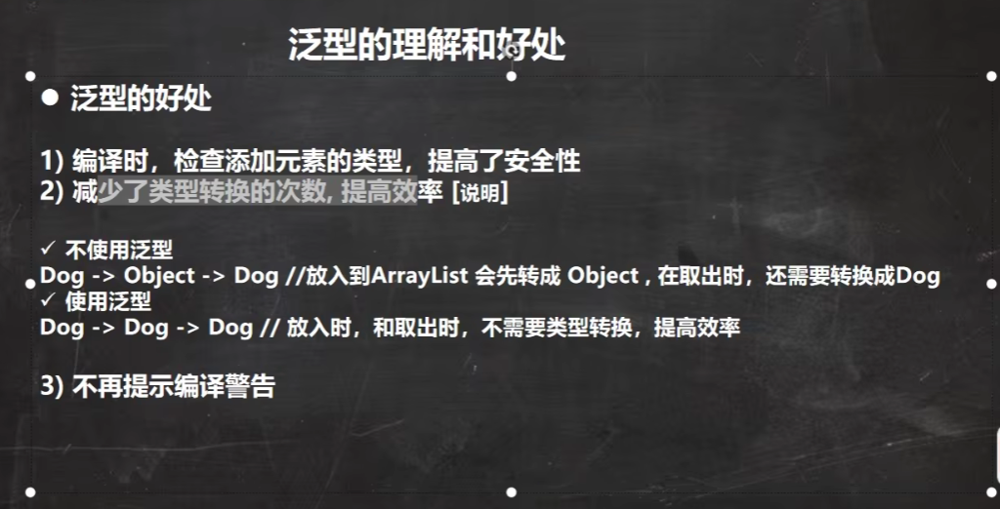
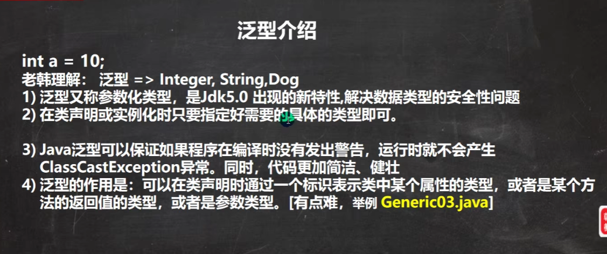
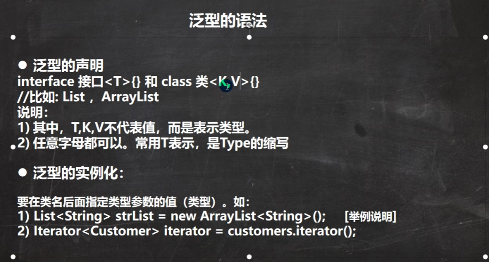
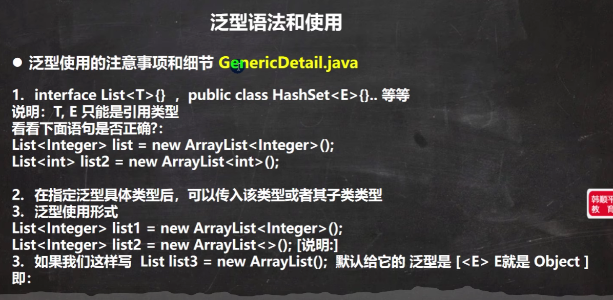
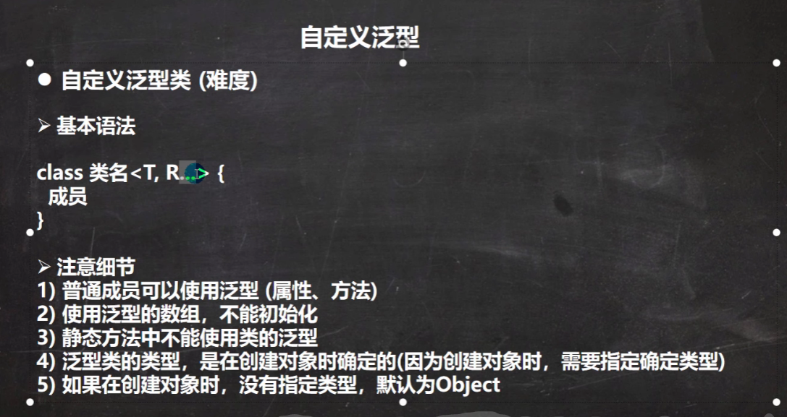
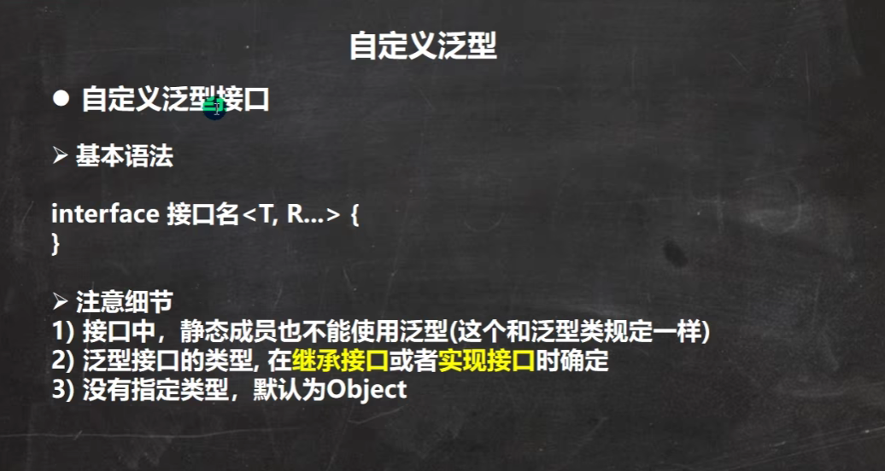
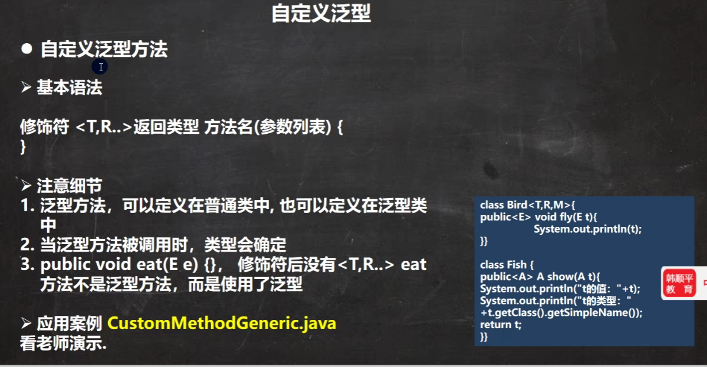
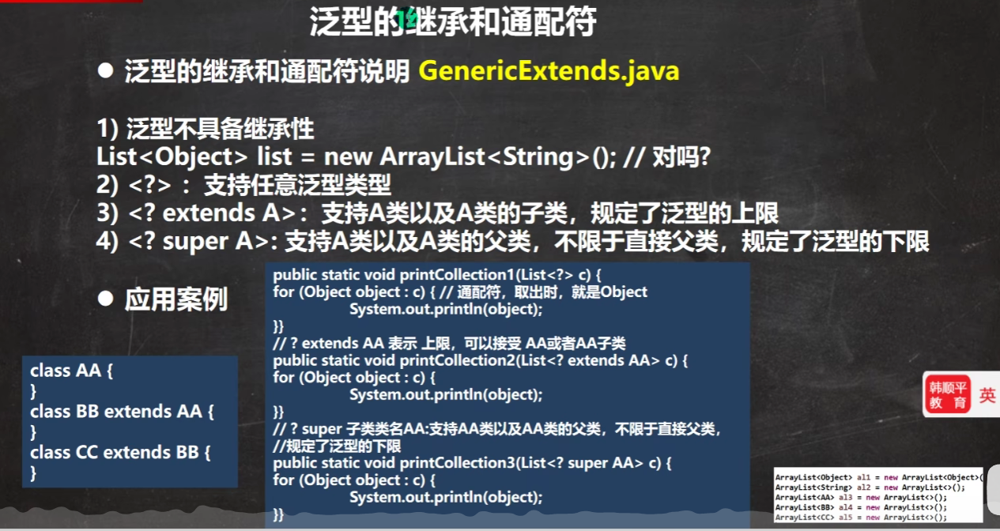
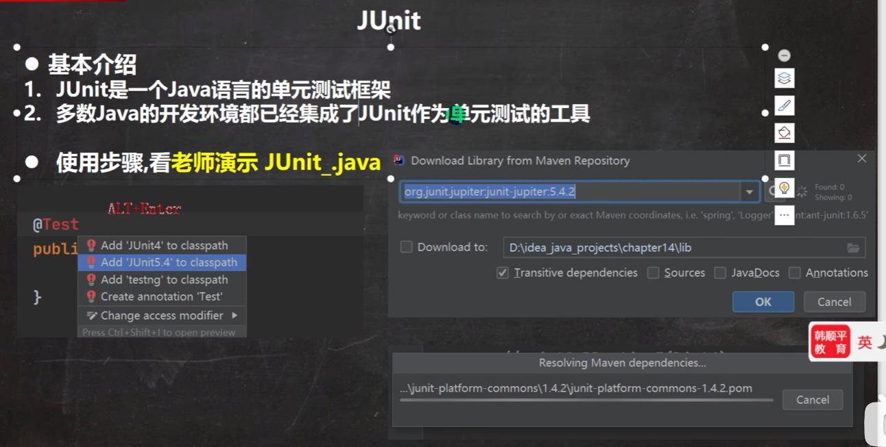
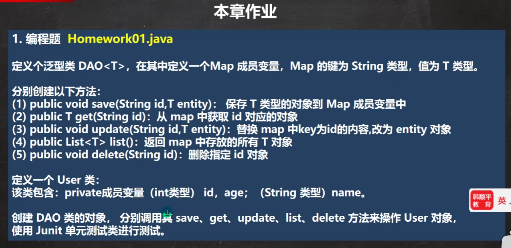

# Javase笔记 day13 泛型

## 1.泛型的基本介绍







## 2. 泛型的细节



```java
import java.util.HashSet;

/**
 * 泛型
 */
public class GenericDemo01 {
    public static void main(String[] args) {
        HashSet<String> strings = new HashSet<>();
        strings.add("adaf");
        // strings.add(1);

        /*
        细节
         */
        // 细节1：泛型只能是引用类型，不能是基本数据类型
        HashSet<Integer> set = new HashSet<Integer>();
        //HashSet<Integer> set0 = new HashSet<int>();// 不能是基本数据类型

        // 细节2：泛型指定后，接受时只能接受指定类型或者指定类型的子类型
        HashSet<GenericDemo01Father> set1 = new HashSet<GenericDemo01Father>();
        set1.add(new GenericDemo01Father());
        set1.add(new GenericDemo01Son());
        HashSet<GenericDemo01Son> set2 = new HashSet<GenericDemo01Son>();
        set2.add(new GenericDemo01Son());
        //set2.add(new GenericDemo01Father());// 这里不允许

        // 细节3：泛型的写法有2种，推荐第二种
        HashSet<String> set3 = new HashSet<String>();
        HashSet<String> set4 = new HashSet<>();// 编译器会进行类型推断

        // 细节4：不指定泛型时，会默认是Object
        HashSet set5 = new HashSet();// 等价于 HashSet<Object> set5 = new HashSet<Object>();
        HashSet<Object> set6 = new HashSet<Object>();

    }
}
class GenericDemo01Father { }
class GenericDemo01Son extends GenericDemo01Father { }
```

## 3. 自定义泛型



```java
/**
 * 泛型自定义
 *  类
 */
public class GenericDemo02CustomClass {
    public static void main(String[] args) {
        GenericDemo02<String, Integer, Double> demo02 = new GenericDemo02<>("test", "a", 2, 3.0D);
    }
}

/**
 * 1.泛型可以用于类的成员(属性和方法种)
 * 2.定义泛型数组时不能初始化(因为泛型是在创建对象时，才知道泛型的具体类型，而定义时无法知道泛型的具体类型，所以无法初始化)
 * 3.静态成员中无法使用泛型，原因和第二点相同
 *
 */
class GenericDemo02<T,R,M> {
    String name;
    T t;
    R r;
    M m;
    // 泛型数组在定义时无法初始化
    //T[] tarr = new T[8];
    T[] tarr;

    // 静态成员无法使用泛型
    // static M staticM;
    // static M getStaticM () {
    //    return M;
    // }

    public GenericDemo02(String name, T t, R r, M m) {
        this.name = name;
        this.t = t;
        this.r = r;
        this.m = m;
    }

    public String getName() {
        return name;
    }

    public void setName(String name) {
        this.name = name;
    }

    public T getT() {
        return t;
    }

    public void setT(T t) {
        this.t = t;
    }

    public R getR() {
        return r;
    }

    public void setR(R r) {
        this.r = r;
    }

    public M getM() {
        return m;
    }

    public void setM(M m) {
        this.m = m;
    }
}
```



```java
/**
 * 自定义泛型
 *   接口
 */
public class GenericDemo03CustomInterface {
    public static void main(String[] args) {
        GenericDemo03ProImpl genericDemo03Pro = new GenericDemo03ProImpl();
        GenericDemo03Impl genericDemo03 = new GenericDemo03Impl();
        GenericDemo03Impl2 genericDemo03Impl2 = new GenericDemo03Impl2();
    }
}
interface GenericDemo03<T,R> {
    // 不能在静态属性使用泛型,接口中的属性都是 public static final修饰的
    // T t;
    // R r;

    T getT();
    void setT(T t);
    R getR();
    void setR(R r);
}

interface GenericDemo03Pro extends GenericDemo03<String, Integer> {
}
// GenericDemo03Pro接口继承GenericDemo03接口时指定了泛型，所以类去实现接口时，泛型T和R都被替换成了String Integer
class GenericDemo03ProImpl implements GenericDemo03Pro {
    @Override
    public String getT() {
        return null;
    }

    @Override
    public void setT(String s) {

    }

    @Override
    public Integer getR() {
        return null;
    }

    @Override
    public void setR(Integer integer) {

    }
}
// GenericDemo03Impl类去实现接口时，给GenericDemo03接口指定了泛型，泛型T和R都被替换成了Double Short
class GenericDemo03Impl implements GenericDemo03<Double,Short> {
    @Override
    public Double getT() {
        return null;
    }

    @Override
    public void setT(Double aDouble) {

    }

    @Override
    public Short getR() {
        return null;
    }

    @Override
    public void setR(Short aShort) {

    }
}
// GenericDemo03Impl类去实现接口时，没有给GenericDemo03接口指定泛型，泛型T和R都被替换成了Object
class GenericDemo03Impl2 implements GenericDemo03 {
    @Override
    public Object getT() {
        return null;
    }

    @Override
    public void setT(Object o) {

    }

    @Override
    public Object getR() {
        return null;
    }

    @Override
    public void setR(Object o) {

    }
}
```



```java
import java.util.ArrayList;

/**
 * 自定义泛型方法
 */
public class GenericDemo04CustomMethod {
    public static void main(String[] args) {
        GenericDemo04Class aClass = new GenericDemo04Class();
        aClass.normalMethod();
        aClass.genericMethod("test", 25);

        GenericDemo04Generic<String, Integer> generic = new GenericDemo04Generic<>();
        generic.normalMethod();
        generic.genericMethod(2.5f, 1L);// Float  Long
        generic.genericMethod(1.0d, new ArrayList(), "class");
    }
}
class GenericDemo04Class {
    public void normalMethod() {
        System.out.println("普通类 普通方法");
    }

    public <E,M> void genericMethod(E r, M m) {
        System.out.println("普通类 泛型方法");
        System.out.println(r.getClass());
        System.out.println(m.getClass());
    }
}

class GenericDemo04Generic<T,R> {
    public void normalMethod() {
        System.out.println("泛型类 普通方法");
    }

    public <E,M> void genericMethod(E r, M m) {
        System.out.println("泛型类 泛型方法");
        System.out.println(r.getClass());
        System.out.println(m.getClass());
    }
    public <E,R> void genericMethod(E e, R r, T t) {
        System.out.println("泛型类 泛型方法");
        System.out.println("泛型方法的泛型：" + e.getClass());
        // 与类泛型同名时，优先使用泛型方法定义的泛型
        System.out.println("泛型方法的泛型：" + r.getClass());
        System.out.println("泛型类的泛型：" + t.getClass());
    }
}
```

## 4. 泛型通配符




## 6. JUnit



```java
import org.junit.jupiter.api.Test;

/**
 * JUnit java的单元测试工具
 */
public class JUnitDemo01 {
    public static void main(String[] args) {
        // 想要测试代码只能创建main方法，然后创建对象调用。
        new JUnitDemo01Class().m1();
        new JUnitDemo01Class().m2();
        // 有了JUnit后，我们只需要一个@Test注解就可以在方法上运行
    }
}
class JUnitDemo01Class {
    
    @Test
    public void m1() {
        System.out.println("m1");
    }
    public void m2() {
        System.out.println("m1");
    }
}


```

## 7. 课后练习




