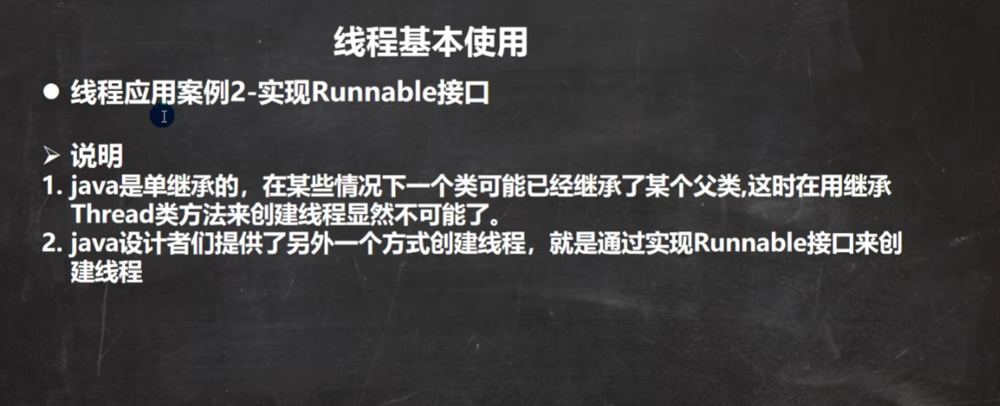

# Javase笔记 day14 多线程

## 1. 多线程基本介绍


```java
/**
 * 线程的基本介绍 使用方法
 *   1.继承Thread类(Thread类也是实现了Runnable接口，所以需要重写run方法)
 *   2.实现Runnable接口
 */
public class ThreadDemo01Thread {
    public static void main(String[] args) {
        //线程启动
        ThreadDemo01A threadDemo01A = new ThreadDemo01A();
        /**
         * 为什么是调用start方法？而不是直接调用run方法？
         *   因为run方法不是实现多线程的方法，真正实现多线程的方法是start0(),这个方法由jvm来调用。
         *   start0()中会调用run()方法。
         */
        threadDemo01A.start();
        // 子线程不会阻塞主线程
        System.out.println("线程名=" + Thread.currentThread().getName() + "主线程main继续执行");
        for (int i = 0; i < 80; i++) {
            System.out.println("main执行 i=" + i);
            try {
                Thread.sleep(1000);
            } catch (InterruptedException e) {
                throw new RuntimeException(e);
            }
        }
    }
}
class ThreadDemo01A extends Thread {
    int times = 0;
    @Override
    public void run() {

        while (true) {
            System.out.println("线程名=" + Thread.currentThread().getName() + "自定义run 执行 i=" + (++times));
            try {
                Thread.sleep(1000);
            } catch (InterruptedException e) {
                throw new RuntimeException(e);
            }
            if (times == 80)
                break;
        }
    }
}
```




```java
/**
 * 线程的基本介绍 使用方法
 *   1.继承Thread类(Thread类也是实现了Runnable接口，所以需要重写run方法)
 *   2.实现Runnable接口
 */
public class ThreadDemo02Runnable {
    public static void main(String[] args) {
        ThreadDemo01A threadDemo01A = new ThreadDemo01A();
        Thread thread = new Thread(threadDemo01A);
        thread.start();
        System.out.println("主线程=" + Thread.currentThread().getName() + " main 执行");
        for (int i = 0; i < 40; i++) {
            System.out.println("main的i=" + i);
            try {
                Thread.sleep(1000);
            } catch (InterruptedException e) {
                throw new RuntimeException(e);
            }
        }
    }
}
class ThreadDemo02A implements Runnable {
    int times = 0;
    @Override
    public void run() {
        while (true) {
            System.out.println("子线程=" + Thread.currentThread().getName() + " run 执行" + (++times));
            try {
                Thread.sleep(1000);
            } catch (InterruptedException e) {
                throw new RuntimeException(e);
            }
            if (times == 80)
                break;
        }
    }
}
```


## 2. 多线程售票问题


```java
/**
 * 多线程之售票问题
 */
public class ThreadDemo03SellTicket {
    public static void main(String[] args) {
        // 继承Thread
//        TD03Thread thread1 = new TD03Thread();
//        TD03Thread thread2 = new TD03Thread();
//        TD03Thread thread3 = new TD03Thread();
//        thread1.start();
//        thread2.start();
//        thread3.start();

        TD03Runnable runnable1 = new TD03Runnable();
        TD03Runnable runnable2 = new TD03Runnable();
        TD03Runnable runnable3 = new TD03Runnable();
        Thread runThead1 = new Thread(runnable1);
        Thread runThead2 = new Thread(runnable2);
        Thread runThead3 = new Thread(runnable3);
        runThead1.start();
        runThead2.start();
        runThead3.start();
    }

}
class TD03Thread extends Thread {
    private static int ticketNum = 100;
    @Override
    public void run() {
        while (true) {
            if (ticketNum < 0) {
                System.out.println("售票结束");
                break;
            }

            try {
                Thread.sleep(50);
            } catch (InterruptedException e) {
                throw new RuntimeException(e);
            }

            System.out.println(Thread.currentThread().getName() + "售票一张，剩余票数=" + (--ticketNum));
        }
    }
}

class TD03Runnable implements Runnable {
    private static int ticketNum = 100;
    @Override
    public void run() {
        while (true) {
            if (ticketNum < 0) {
                System.out.println("售票结束");
                break;
            }

            try {
                Thread.sleep(50);
            } catch (InterruptedException e) {
                throw new RuntimeException(e);
            }

            System.out.println(Thread.currentThread().getName() + "售票一张，剩余票数=" + (--ticketNum));
        }
    }
}
```

## 3. 线程终止


```java
/**
 * 线程终止
 * 1.run方法运行结束，线程就结束了
 * 2.通过通知方式。
 */
public class ThreadDemo04ThreadStop {
    public static void main(String[] args) {
        ThreadDemo04Thread demo01A = new ThreadDemo04Thread();
        Thread thread = new Thread(demo01A);
        thread.start();

        System.out.println("main线程停止10s");
        try {
            Thread.sleep(10*1000);
        } catch (InterruptedException e) {
            throw new RuntimeException(e);
        }
        demo01A.setStopFlag(true);
    }
}
class ThreadDemo04Thread implements Runnable {
    private int count = 1;
    private boolean stopFlag = false;
    @Override
    public void run() {
        while (!stopFlag) {
            System.out.println(Thread.currentThread().getName() + " run执行。。。。 次数=" + (count++));
            try {
                Thread.sleep(1000);
            } catch (InterruptedException e) {
                throw new RuntimeException(e);
            }
        }
    }

    public void setStopFlag(boolean stopFlag) {
        this.stopFlag = stopFlag;
    }
}
```

## 4. 线程常用方法（第一组 线程中断）


```java
/**
 * 线程常用方法演示 第一组(线程中断)
 */
public class ThreadDemo05MethodPart1 {
    public static void main(String[] args) {
        ThreadDemo05Runnable threadDemo05Runnable = new ThreadDemo05Runnable();
        Thread thread = new Thread(threadDemo05Runnable);
        // setName 设置线程名
        thread.setName("张三");
        // setPriority 设置线程优先级,1-10,数字越大优先级越高
        thread.setPriority(Thread.MIN_PRIORITY);
        // start 启动线程
        thread.start();
        // getName 获取线程名
        System.out.println("线程名：" + thread.getName());
        // getPriority 获取线程的优先级
        System.out.println("线程优先级" + thread.getPriority());

        for (int i = 0; i < 5; i++) {
            try {
                Thread.sleep(2000);
            } catch (InterruptedException e) {
                throw new RuntimeException(e);
            }
            System.out.println("main线程运行...." + i);
        }

        // 中断线程(中断线程的休眠状态)
        thread.interrupt();// 中断线程的20s休眠，让线程继续执行。

        /*
        运行结果如下：
            线程名：张三
            线程优先级1
            张三在吃包子 0
            ...
            张三在吃包子 97
            张三在吃包子 98
            张三开始休眠20s
            main线程运行....0
            main线程运行....1
            main线程运行....2
            main线程运行....3
            main线程运行....4
            张三 被中断了休眠
            张三在吃包子 0
            张三在吃包子 1
            ...
            张三在吃包子 98
            张三开始休眠20s
         */

    }
}
class ThreadDemo05Runnable implements Runnable {
    @Override
    public void run() {
        while (true) {
            for (int i = 0; i < 99; i++) {
                System.out.println(Thread.currentThread().getName() + "在吃包子 " + i);
            }

            try {
                System.out.println(Thread.currentThread().getName() + "开始休眠20s");
                Thread.sleep(20000);
            } catch (InterruptedException e) {
                // throw new RuntimeException(e);
                System.out.println(Thread.currentThread().getName() + " 被中断了休眠");
            }
        }
    }
}
```

## 5.线程常用方法（第二组 线程插队）


```java
/**
 * 线程常用方法 第二组 线程插队
 */
public class ThreadDemo06MethodPart2 {
    public static void main(String[] args) {
        ThreadDemo06RunnableA threadDemo06RunnableA = new ThreadDemo06RunnableA();
        Thread thread = new Thread(threadDemo06RunnableA);
        thread.start();

        for (int i = 1; i <= 20 ; i++) {
            // 当主线程已经执行了5次后，使用 join 让子线程插队，等子线程全部执行结束后，再执行主线程
            if (i == 6) {
                try {
                    System.out.println("子线程开始插队...........");
                    thread.join();// 让子线程插队
                    // Thread.yield();// 礼让子线程，但是不一定成功，取决于操作系统底层
                } catch (Exception e) {
                    throw new RuntimeException(e);
                }
            }
            try {
                Thread.sleep(1000);
            } catch (InterruptedException e) {
                throw new RuntimeException(e);
            }
            System.out.println(Thread.currentThread().getName() + "主线程 执行 hi" + i);
        }
    }
}
class ThreadDemo06RunnableA implements Runnable {
    @Override
    public void run() {
        for (int i = 1; i <= 20 ; i++) {
            try {
                Thread.sleep(1000);
            } catch (InterruptedException e) {
                throw new RuntimeException(e);
            }
            System.out.println(Thread.currentThread().getName() + "子线程 执行 hello" + i);
        }
    }
}
```

## 6. 守护线程


```java
/**
 * 线程常用方法 守护线程
 */
public class ThreadDemo07MethodPart3 {
    public static void main(String[] args) {
        ThreadDemo07Daemon threadDemo07Daemon = new ThreadDemo07Daemon();
        Thread thread = new Thread(threadDemo07Daemon);
        // 将线程设置为守护线程,让所有线程结束后子线程也自动结束
        thread.setDaemon(true);
        thread.start();
        for (int i = 0; i < 5; i++) {
            try {
                Thread.sleep(1000);
            } catch (InterruptedException e) {
                throw new RuntimeException(e);
            }
            System.out.println("主线程执行中.....");
        }
    }
}
class ThreadDemo07Daemon implements Runnable {
    @Override
    public void run() {
        while (true) {
            try {
                Thread.sleep(1000);
            } catch (InterruptedException e) {
                throw new RuntimeException(e);
            }
            System.out.println("守护线程执行中.....");
        }
    }
}
```

## 7. 线程的生命周期


```java
/**
 * 线程的生命周期
 */
public class ThreadDemo08ThreadState {
    public static void main(String[] args) {
        ThreadDemo08 threadDemo08 = new ThreadDemo08();
        System.out.println(threadDemo08.getName() + " 初始 线程状态= " + threadDemo08.getState());
        threadDemo08.start();
        System.out.println(threadDemo08.getName() + " 启动 线程状态= " + threadDemo08.getState());
        while (threadDemo08.getState() != Thread.State.TERMINATED) {
            System.out.println(threadDemo08.getName() + " 执行 线程状态= " + threadDemo08.getState());
            try {
                Thread.sleep(1000);
            } catch (InterruptedException e) {
                throw new RuntimeException(e);
            }
            System.out.println("main线程执行。。。");
        }
        System.out.println(threadDemo08.getName() + " 结束 线程状态= " + threadDemo08.getState());
    }
}
class ThreadDemo08 extends Thread {
    @Override
    public void run() {
        while (true) {
            for (int i = 0; i < 20; i++) {
                try {
                    Thread.sleep(1000);
                } catch (InterruptedException e) {
                    throw new RuntimeException(e);
                }
                System.out.println("子线程执行=" + i);
            }
            break;
        }
    }
}
```

## 8. 线程同步机制


```java
/**
 * 线程同步机制
 */
public class ThreadDemo09Synchronized {
    public static void main(String[] args) {
        // 继承Thread
        TD09Runnable runnable1 = new TD09Runnable();
        Thread runThead1 = new Thread(runnable1);
        Thread runThead2 = new Thread(runnable1);
        Thread runThead3 = new Thread(runnable1);
        runThead1.start();
        runThead2.start();
        runThead3.start();
        while (runThead1.getState() != Thread.State.TERMINATED && runThead2.getState() != Thread.State.TERMINATED && runThead3.getState() != Thread.State.TERMINATED) {
            System.out.println(runThead1.getName() + " 线程状态= " + runThead1.getState());
            System.out.println(runThead2.getName() + " 线程状态= " + runThead2.getState());
            System.out.println(runThead3.getName() + " 线程状态= " + runThead3.getState());
            try {
                Thread.sleep(50);
            } catch (InterruptedException e) {
                throw new RuntimeException(e);
            }
        }
    }
}
class TD09Runnable implements Runnable {
    private static int ticketNum = 100;
    private static boolean loop = true;

    public synchronized void sell() {
        if (ticketNum <= 0) {
            System.out.println("售票结束");
            loop = false;
            return;
        }

        try {
            Thread.sleep(50);
        } catch (InterruptedException e) {
            throw new RuntimeException(e);
        }

        System.out.println(Thread.currentThread().getName() + "售票一张，剩余票数=" + (--ticketNum));
    }

    @Override
    public void run() {
        while (loop) {
            sell();
            try {
                Thread.sleep(50);
            } catch (InterruptedException e) {
                throw new RuntimeException(e);
            }
        }
    }
}


```

## 9. 互斥锁


```java
/**
 * 线程同步
 *     互斥锁
 *
 */
public class ThreadDemo10Lock {
    public static void main(String[] args) {
        TD10Runnable runnable1 = new TD10Runnable();
        Thread runThead1 = new Thread(runnable1);
        Thread runThead2 = new Thread(runnable1);
        Thread runThead3 = new Thread(runnable1);
        runThead1.start();
        runThead2.start();
        runThead3.start();
    }
}
class TD10Runnable implements Runnable {
    private static int ticketNum = 100;
    private static boolean loop = true;
    Object obj = new Object();

    // 非静态的同步方法，锁是 this ，也可以是其他的对象
    public synchronized void sell() {
        if (ticketNum <= 0) {
            System.out.println(Thread.currentThread().getName() + "售票结束");
            loop = false;
            return;
        }

        try {
            Thread.sleep(50);
        } catch (InterruptedException e) {
            throw new RuntimeException(e);
        }
        System.out.println(Thread.currentThread().getName() + "售票一张，剩余票数=" + (--ticketNum));
    }

    // 静态的同步方法，锁是 当前类.class
    public static synchronized void sell2() {
        if (ticketNum <= 0) {
            System.out.println(Thread.currentThread().getName() + "售票结束");
            loop = false;
            return;
        }

        try {
            Thread.sleep(50);
        } catch (InterruptedException e) {
            throw new RuntimeException(e);
        }
        System.out.println(Thread.currentThread().getName() + "售票一张，剩余票数=" + (--ticketNum));
    }

    // 非静态方法中 同步代码块的锁是 this,也可以是其他对象，但是必须保证多线程访问的锁对象是同一个。
    public void sell3() {
        synchronized(/*this*/ obj) {
            if (ticketNum <= 0) {
                System.out.println(Thread.currentThread().getName() + "售票结束");
                loop = false;
                return;
            }

            try {
                Thread.sleep(50);
            } catch (InterruptedException e) {
                throw new RuntimeException(e);
            }
            System.out.println(Thread.currentThread().getName() + "售票一张，剩余票数=" + (--ticketNum));
        }
    }

    // 静态方法中 同步代码块的锁是 当前类.class
    public static void sell4() {
        synchronized(TD10Runnable.class) {
            if (ticketNum <= 0) {
                System.out.println(Thread.currentThread().getName() + "售票结束");
                loop = false;
                return;
            }

            try {
                Thread.sleep(50);
            } catch (InterruptedException e) {
                throw new RuntimeException(e);
            }
            System.out.println(Thread.currentThread().getName() + "售票一张，剩余票数=" + (--ticketNum));
        }
    }

    @Override
    public void run() {
        while (loop) {
            // sell();
            // sell2();
            // sell3();
            sell4();
            try {
                Thread.sleep(50);
            } catch (InterruptedException e) {
                throw new RuntimeException(e);
            }
        }
    }
}
```

## 10. 线程死锁


## 11. 释放锁


## 12. 线程作业


```java
import java.util.Random;
import java.util.Scanner;

/**
 * 多线程作业
 */
public class ThreadDemo11Unit {
    public static void main(String[] args) {
        TD011A td011A = new TD011A();
        TD011B td011B = new TD011B(td011A);
        Thread thread = new Thread(td011A);
        Thread thread2 = new Thread(td011B);
        thread.start();
        thread2.start();

    }
}
class TD011A implements Runnable {
    private static boolean stopFlag = false;
    @Override
    public void run() {
        while (!stopFlag) {
            System.out.println(Thread.currentThread().getName() + "--输出---" + new Random().nextInt(100));
            try {
                Thread.sleep(1000);
            } catch (InterruptedException e) {
                throw new RuntimeException(e);
            }
        }
    }
    public void setStopFlag(boolean stopFlag) {
        this.stopFlag = stopFlag;;
    }
}
class TD011B implements Runnable {
    private TD011A a;

    public TD011B(TD011A a) {
        this.a = a;
    }

    @Override
    public void run() {
        while (true) {
            String input = new Scanner(System.in).nextLine();
            System.out.println(Thread.currentThread().getName() + " 你输入了：" + input);
            if (input.equals("exit")) {
                System.out.println(Thread.currentThread().getName() + " 退出");
                a.setStopFlag(true);
                break;
            }
        }
    }
}
```


```java
public class ThreadDemo12Unit2 {
    public static void main(String[] args) {
        TD012User user = new TD012User();
        Thread thread = new Thread(user);
        Thread thread2 = new Thread(user);
        thread.start();
        thread2.start();
    }
}
class TD012User implements Runnable {
    private int money = 10000;
    @Override
    public void run() {
        while (true) {
            synchronized (this) {
                if (money <= 0) {
                    System.out.println(Thread.currentThread().getName() + "余额不足");
                    break;
                }
                System.out.println(Thread.currentThread().getName() + "取钱1000，余额=" + (money-=1000));
            }
            try {
                Thread.sleep(1000);
            } catch (InterruptedException e) {
                throw new RuntimeException(e);
            }
        }
    }
}


```
